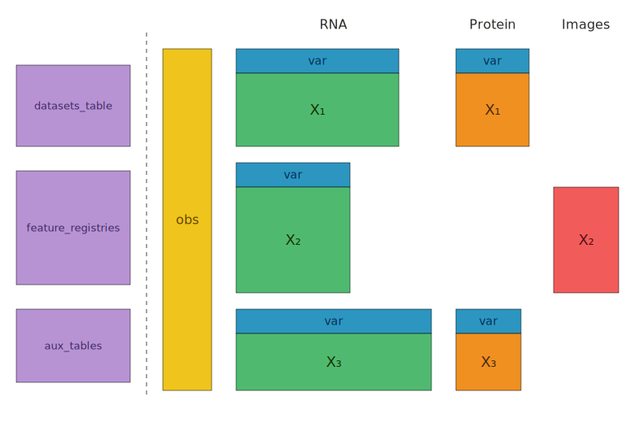
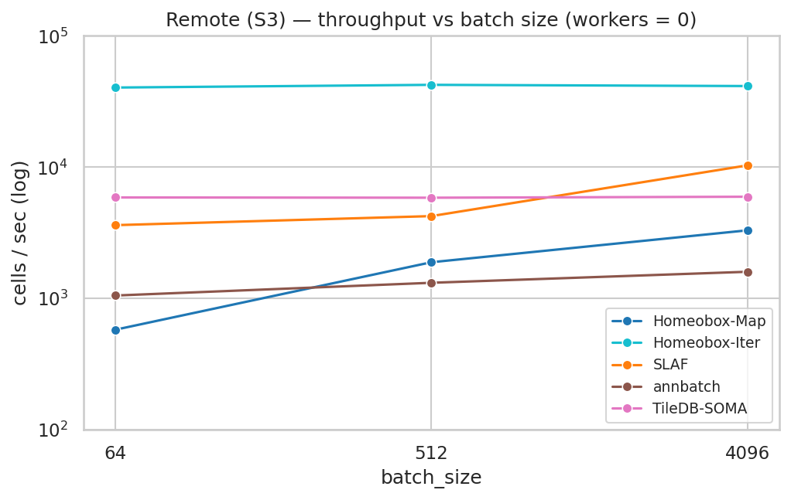

# homeobox

Homeobox is a multimodal database for interactive analysis and ML training at scale. It combines the search and versioning capabilities of [LanceDB](https://lancedb.com) with the scalable array storage of [Zarr](https://zarr.dev).

A single homeobox atlas can hold sparse single-cell gene expression, dense protein and embedding features, 2D/3D/4D/5D images, biomolecular structures, and free text. A single dataloader streams batches across all of them with no intermediate ML-only copies and no special modality-specific entrypoints. Our design philosophy is to be *extremely flexible, while still quite fast*.

- **[Documentation](https://epiblastai.github.io/homeobox/)**

---

## Why homeobox

### Motivating cases

- Hundreds or thousands of `h5ad` or `h5mu` files from different assays, panels, and organisms that you want to query and train on as a single collection.
- Repositories of large images stored in Zarr / OME-Zarr, DICOM, or TIFF — 2D, 3D, or 4D, sometimes >1 TB each, with associated text descriptions.
- Single-cell images, masks, and associated feature data (e.g. CellProfiler vectors).
- Any combination of the above, in one queryable store.

Existing tools tend to optimise for single large datasets from a single modality, often through a laborious standardisation step that drops or duplicates data to fit a rectangular schema. Homeobox's `RaggedAtlas` unifies heterogeneous data into a single store that supports SQL / vector / full-text search, interactive `AnnData` / `MuData` reconstruction, and ML streaming — without that flattening step.

### Ragged feature spaces, unified obs

Real-world atlases pull together datasets that were not designed to be compatible: different feature panels, different assays and imaging modalities, different metadata fields. Conventional tools handle this by padding to a union matrix (wasteful) or intersecting to shared features (lossy).

A `RaggedAtlas` keeps a single shared `obs` table while letting each dataset retain its own feature axis (or no features at all, for raw images). The obs table lives in LanceDB; each dataset occupies its own Zarr group with its own feature ordering; every row carries a pointer into its group.



At query time, the reconstruction layer joins the feature spaces on the fly: it computes the union or intersection of global feature indices, scatters each group's data into the right columns, and returns a single AnnData / MuData with every row correctly placed. Nothing is dropped at ingest, and there is no ambiguity about whether a value is a true zero or padding.

---

## Installation

Prebuilt wheels are available on PyPI. Requires Python 3.13.

```bash
pip install homeobox          # core: atlas, querying, ingestion
pip install homeobox[ml]      # + PyTorch dataloader
pip install homeobox[io]      # + S3/GCS/Azure
pip install homeobox[viz]     # + marimo, matplotlib
pip install homeobox[all]     # everything
```

To build from source (requires a Rust toolchain):

```bash
curl -LsSf https://astral.sh/uv/install.sh | sh
curl --proto '=https' --tlsv1.2 -sSf https://sh.rustup.rs | sh
uv sync
maturin develop --release
```

---

## Quickstart

```python
import os
import numpy as np
import scanpy as sc
import homeobox as hox

# 1. Define schemas: one for gene features, one for cell metadata.
#    Each pointer column is declared with PointerField.declare, which
#    binds the column name to a registered feature_space.
class GeneFeature(hox.FeatureBaseSchema):
    gene_symbol: str

class CellSchema(hox.HoxBaseSchema):
    gene_expression: hox.SparseZarrPointer | None = hox.PointerField.declare(
        feature_space="gene_expression"
    )

# 2. Create an atlas
atlas_dir = "./hox_example_atlas/"
os.makedirs(atlas_dir, exist_ok=True)
atlas = hox.create_or_open_atlas(
    atlas_path=atlas_dir,
    obs_schemas={"cells": CellSchema},
    dataset_table_name="datasets",
    dataset_schema=hox.DatasetSchema,
    registry_schemas={"gene_expression": GeneFeature},
)

# 3. Load a dataset and register its genes
adata = sc.datasets.pbmc3k()  # 2 700 PBMCs, raw counts, sparse CSR
adata.X = adata.X.astype(np.uint32)  # the counts layer must be np.uint32
features = [GeneFeature(uid=g, gene_symbol=g) for g in adata.var_names]
atlas.register_features("gene_expression", features)

# 4. Prepare var and ingest. `field_name` selects the cell-schema column
#    to populate; its feature_space is resolved from PointerField.declare.
adata.var["global_feature_uid"] = adata.var_names
record = hox.DatasetSchema(
    zarr_group="pbmc3k", feature_space="gene_expression", n_rows=adata.n_obs,
)
hox.add_from_anndata(
    atlas, adata, field_name="gene_expression",
    zarr_layer="counts", dataset_record=record,
)

# 5. Optimize tables and create a snapshot
atlas.optimize()
atlas.snapshot()

# 6. Open the atlas and query
atlas_r = hox.RaggedAtlas.checkout_latest(atlas_dir)
result = atlas_r.query().limit(500).to_anndata()
print(result)  # AnnData object with n_obs × n_vars = 500 × 32738
```

### Multimodal in one row

The same shape scales to any number of modalities — declare one pointer column per feature space on a single obs schema:

```python
class MultimodalCell(hox.HoxBaseSchema):
    # Shared obs fields
    cell_type: str | None
    tissue: str | None

    # Optional pointers — cells measured by only one assay are first-class,
    # no padding rows, no presence flags inserted at ingest.
    gene_expression: hox.SparseZarrPointer | None = hox.PointerField.declare(
        feature_space="gene_expression"
    )
    protein_abundance: hox.DenseZarrPointer | None = hox.PointerField.declare(
        feature_space="protein_abundance"
    )
    image_tiles: hox.DenseZarrPointer | None = hox.PointerField.declare(
        feature_space="image_tiles"
    )
```

A query against this atlas streams within-row multimodal batches through a single `DataLoader`, regardless of how many modalities each cell has. See [`homeobox_examples/multimodal_perturbation_atlas/schema.py`](homeobox_examples/multimodal_perturbation_atlas/schema.py) for a five-modality production schema (gene expression, chromatin accessibility, protein abundance, image features, image tiles) plus perturbation, publication, and donor tables.

---

## Example Notebooks

The `notebooks/` directory contains self-contained [marimo](https://marimo.io) notebooks that work after a plain `pip install homeobox` (no repo clone needed).

| Notebook | Description |
|----------|-------------|
| [`multimodal_perturbation_atlas.py`](https://colab.research.google.com/drive/1-5lQXRLpKrpeYAQ14UIVK7CMq_75tp6Y#scrollTo=87b338c7) | Explore a 120M+, agent-curated, cell atlas with over 130,000 genetic, chemical, and biologic perturbations and 5 modalities. |

---

## Performance

Beyond raw numbers, the case for homeobox is generality and integration. One library handles cell tables, sparse matrices, dense features, images, embeddings, and text — there is no separate stack for non-tabular modalities. New modalities are added by writing a feature-space spec, not by waiting for upstream support. And because storage is plain LanceDB + Zarr, homeobox plays directly with the broader Python + Rust data ecosystem (Lance, DuckDB, Polars, zarrs).

On a 1M-cell × 20k-gene synthetic atlas, the homeobox iterable dataloader sustains **~70k cells/sec on local NVMe** and **~40k cells/sec streaming from S3** at a single worker — saturating local disk and running roughly an order of magnitude faster than the next remote-capable system in the sweep.



See [docs/dataloader_benchmark.md](docs/dataloader_benchmark.md) for the full sweep across nine dataloaders (SLAF, scDataset, BioNeMo SCDL, annbatch, TileDB-SOMA, cell-load, and the two homeobox surfaces), including local/remote/perturbation workloads, memory profiles, and reproducible scripts.

---

## Versioning

Homeobox separates the writable ingest path from the read/query path with an explicit snapshot model: ingest writes Zarr arrays and cell records freely (in parallel if needed), `optimize()` compacts Lance fragments and rebuilds indexes, `snapshot()` validates consistency and records the current Lance table versions, and `checkout(version)` opens a read-only atlas pinned to that snapshot. Queries and training runs execute against a frozen, reproducible view; concurrent ingestion does not affect any checked-out handle. See [docs/versioning.md](docs/versioning.md) for the full lifecycle.
