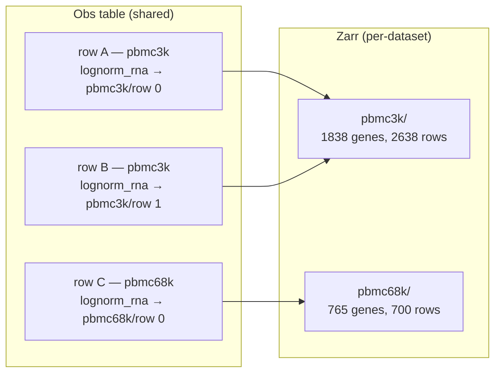
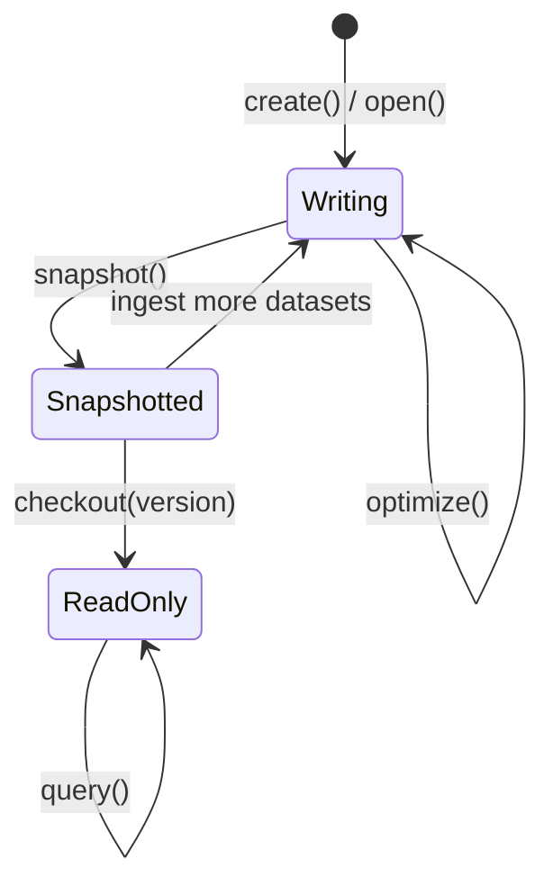

# RaggedAtlas

## What makes an atlas "ragged"

Traditional atlas tools store all observations in a single rectangular feature matrix, which means every row must be profiled for the same set of features. In practice, datasets are collected with different assay panels, different gene sets, and different subsets of modalities.

`RaggedAtlas` takes a different approach: each obs table is shared and flat, but each row carries a pointer into its own zarr group. Two rows from different datasets will point to separate zarr groups, possibly with different feature sets. The atlas is regular in the row dimension but "ragged" in the feature dimension.



At query time, the reconstruction layer joins the feature spaces across groups: it computes the union or intersection of global feature indices, scatters each group's data into the right columns, and returns a single AnnData with every row and every feature, zero-filled where a row's dataset didn't measure that feature.

This makes it straightforward to build an atlas from a mix of unimodal and multimodal datasets. For example, a row that was only RNA-sequenced will have a valid `gene_expression` pointer and a null `protein_abundance` pointer. Adding a CITE-seq dataset later for new rows doesn't require changing anything, but still allows for writing queries that either join their gene expression spaces, focus on proteins, or load rows with multimodal readouts.

### Multiple obs tables

An atlas can also hold more than one obs table. Each obs table is an independent flat table with its own `HoxBaseSchema` subclass and its own pointer columns; datasets and registries (which live at the atlas level) are shared across them. Use multiple obs tables when different cohorts of rows have fundamentally different metadata or pointer shapes — for example a `cells` table for single-cell observations and a separate `tiles` table for whole-slide image tiles. Pointer fields are keyed by `field_name` across the whole atlas: two obs tables may both expose a column named e.g. `gene_expression` as long as they agree on its `feature_space`, in which case the shared declaration collapses to a single entry. Declaring the same field name with conflicting `feature_space` values in different obs tables raises at construction.

---

## Snapshot model: write freely, query safely

LanceDB tables and zarr object stores both support concurrent writers. Ingestion can run in parallel across many processes without coordination. Each dataset gets its own zarr group, and `merge_insert` handles concurrent feature registration without races.

However, a live (tip-of-table) view is not suitable for queries or ML training. `RaggedAtlas` solves this with an explicit snapshot model:

1. **Ingest** — write zarr arrays and obs records freely, in any order, potentially in parallel.
2. **`optimize()`** — compact Lance fragments, assign dense `global_index` values to any newly registered features, and rebuild FTS indexes.
3. **`snapshot()`** — validate consistency and record the current Lance table versions in `atlas_versions`. Returns a version number.
4. **`checkout(version)`** — open a read-only atlas pinned to a specific snapshot. Every table is pinned to the exact Lance version recorded at snapshot time, making the view fully reproducible.
5. **`query()`** — only available on a checked-out atlas. Calling it on a writable atlas raises immediately.



---

## Walkthrough

The rest of this page walks through a complete example using two PBMC datasets from scanpy. They have different feature sets (1838 vs 765 genes, 208 shared) and different obs column names.

Both datasets contain log-normalized dense expression values (highly variable genes), so we register a custom `lognorm_rna` spec rather than using the built-in sparse `gene_expression` spec.

### 1. Register a custom spec

A `ZarrGroupSpec` declares the expected zarr layout for a feature space. Registering it before defining any schema is required — the schema's pointer field names are validated against the spec registry at class definition time.

```python
import numpy as np
import homeobox as hox
from homeobox.group_specs import (
    ZarrGroupSpec, FeatureSpaceSpec, LayersSpec, ArraySpec, register_spec,
)
from homeobox.reconstruction import DenseFeatureReconstructor

LOGNORM_RNA_SPEC = FeatureSpaceSpec(
    feature_space="lognorm_rna",
    pointer_type=hox.DenseZarrPointer,    # each obs row stores a row index, not a byte range
    has_var_df=True,                      # this space has a feature registry + _feature_layouts rows
    reconstructor=DenseFeatureReconstructor(),
    zarr_group_spec=ZarrGroupSpec(
        layers=LayersSpec(
            required=[ArraySpec(array_name="log_normalized", ndim=2, allowed_dtypes=[np.float32])],
        ),
    ),
)
register_spec(LOGNORM_RNA_SPEC)
```

### 2. Define schemas

A feature schema extends `FeatureBaseSchema` with any modality-specific fields. Here we store the gene symbol alongside the inherited `uid` and `global_index`.

```python
class GeneFeature(hox.FeatureBaseSchema):
    # StableUIDField marks `gene_symbol` as the deterministic source of `uid`:
    # `uid = make_stable_uid(gene_symbol)`. This makes the registry idempotent
    # across rebuilds and lets parallel ingest jobs converge on the same uids
    # for the same gene without coordination.
    gene_symbol: str = hox.StableUIDField.declare(default=...)
```

An obs schema extends `HoxBaseSchema` and declares one pointer field per column the obs table will hold. Each pointer is declared with `PointerField.declare(feature_space=...)`, which binds the column name to a registered feature space. If the space has a registry, `feature_registry_schema` can annotate the linked schema for code parsing and visualization. Column names are free-form — a schema may declare multiple columns in the same feature space. In a multimodal schema, pointer fields are typed `| None` so that rows profiled in only one modality can leave the other pointers null.

```python
class CellSchema(hox.HoxBaseSchema):
    cell_type: str | None = None     # user-defined obs metadata
    lognorm_rna: hox.DenseZarrPointer | None = hox.PointerField.declare(
        feature_space="lognorm_rna",
        feature_registry_schema=GeneFeature,
    )
```

### 3. Create the atlas

`create_or_open_atlas()` initialises the LanceDB tables and opens the zarr store at a single `atlas_path`. It creates `lance_db/` and `zarr_store/` subdirectories on first call and reopens them on subsequent calls. `atlas_path` accepts local paths or cloud URIs (`s3://`, `gs://`, `az://`); pass cloud credentials through `store_kwargs=`. `obs_schemas` is a `{table_name: HoxBaseSchema subclass}` mapping — pass a single-entry dict for the common one-table case, or several entries to register multiple obs tables at once. `registry_schemas` tells the atlas which feature spaces have a feature registry — required for any space with `has_var_df=True`.

```python
atlas = hox.create_or_open_atlas(
    atlas_path="/tmp/pbmc_atlas",
    obs_schemas={"cells": CellSchema},   # single obs table here; add more entries to register additional ones
    dataset_table_name="datasets",
    dataset_schema=hox.DatasetSchema,    # use a subclass to add provenance fields
    registry_schemas={"lognorm_rna": GeneFeature},  # one entry per has_var_df=True space
)
```

### 4. Load the first dataset

```python
import scanpy as sc

pbmc3k = sc.datasets.pbmc3k_processed()
# shape: (2638, 1838) — log-normalized dense float32
# obs columns: n_genes, percent_mito, n_counts, louvain
```

**Build the var DataFrame and register features.** Ingestion requires `adata.var` to have columns exactly matching the registry schema (minus the auto-managed `global_index`), plus a `uid` column whose values are the registry uids for each local feature. An explicit `uid` column is used rather than `var.index` because AnnData only warns (not errors) on duplicate var indexes — a duplicated uid would silently corrupt feature remapping at query time.

Because we declared `gene_symbol` as a `StableUIDField`, the same `compute_stable_uids` call that produces deterministic registry uids also produces the matching var uids. We build one DataFrame and use it for both: registering features in the global registry, and as the per-dataset `adata.var`. `register_features` accepts a Polars DataFrame with at minimum a `uid` column; extra columns are merged into the registry.

```python
import pandas as pd
import polars as pl

var_df = pd.DataFrame(
    {"gene_symbol": pbmc3k.var.index.tolist()},
    index=pbmc3k.var.index,
)
GeneFeature.compute_stable_uids(var_df)  # writes 'uid' inline

# Register the features and update adata.var
atlas.register_features("lognorm_rna", pl.from_pandas(var_df))
pbmc3k.var = var_df
```

**Align obs to the obs schema.** `align_obs_to_schema` renames columns according to `obs_to_schema`, adds `None` for optional fields not present in obs, and drops any columns that have no corresponding schema field.

```python
from homeobox.obs_alignment import align_obs_to_schema

# pbmc3k uses "louvain" for cluster/cell-type labels; our schema expects "cell_type"
pbmc3k_aligned = align_obs_to_schema(
    pbmc3k, CellSchema, obs_to_schema={"louvain": "cell_type"}
)
```

### 5. Ingest

```python
dataset_3k = hox.DatasetSchema(
    zarr_group="pbmc3k",          # path within the object store
    feature_space="lognorm_rna",
    n_rows=pbmc3k.n_obs,
)

n = hox.add_from_anndata(
    atlas,
    pbmc3k_aligned,
    field_name="lognorm_rna",
    zarr_layer="log_normalized",  # destination layer name within the zarr group
    dataset_record=dataset_3k,
)
print(f"ingested {n} rows")  # ingested 2638 rows
```

### 6. Optimize, snapshot, and query

`optimize()` compacts Lance fragments, syncs `global_index` from the registry to `_feature_layouts`, and rebuilds the FTS indexes. Call it after bulk ingestion and before snapshotting.

```python
atlas.optimize()
v0 = atlas.snapshot()  # validates consistency, records table versions, returns version int
print(f"snapshot v{v0}")  # snapshot v0
```

`checkout_latest()` opens a read-only atlas pinned to the snapshot just created. All tables are at their Lance versions as of `v0` — any subsequent writes to the atlas will not be visible through this handle.

```python
atlas_r = hox.RaggedAtlas.checkout_latest("/tmp/pbmc_atlas")
```

Both `obs_schemas` and `store` are optional — the obs tables to open are read from the snapshot record, pointer fields are inferred from each obs table's Arrow schema, and the store is reconstructed from the URI recorded at snapshot time. Pass `obs_schemas={"cells": CellSchema, ...}` explicitly only when you need typed schemas (e.g. to write back into a freshly-restored atlas).

Queries use a fluent builder. The `where` clause accepts any LanceDB SQL predicate against the obs table columns.

```python
cd4 = (
    atlas_r.query()
    .where("cell_type = 'CD4 T cells'")  # any LanceDB SQL predicate
    .to_anndata()
)
print(cd4)
# AnnData object with n_obs × n_vars = 1144 × 1838
```

```python
# Count rows grouped by cell type — only fetches the grouping column
atlas_r.query().count(group_by="cell_type")
```

When the atlas has more than one obs table, `query()` requires `obs_table_name=` to disambiguate; with one table the default resolution picks it automatically.

### 7. Ingest a second dataset

`pbmc68k_reduced` has 765 genes with only 208 overlapping with pbmc3k. It uses `bulk_labels` (not `louvain`) for its cell type labels — a different obs schema from the first dataset.

```python
pbmc68k = sc.datasets.pbmc68k_reduced()
# shape: (700, 765) — log-normalized dense float32
# obs columns: bulk_labels, n_genes, percent_mito, n_counts, ...
```

Register only the new features — `register_features` uses `merge_insert` and will silently skip any gene already in the registry.

```python
var_df_68k = pd.DataFrame(
    {"gene_symbol": pbmc68k.var.index.tolist()},
    index=pbmc68k.var.index,
)
GeneFeature.compute_stable_uids(var_df_68k)

# Register features and update adata.var. This uses merge_insert so stable uid that have already been registered are not duplicated
atlas.register_features("lognorm_rna", pl.from_pandas(var_df_68k))
pbmc68k.var = var_df_68k

# pbmc68k uses "bulk_labels" for cell type — map it to the same "cell_type" field
pbmc68k_aligned = align_obs_to_schema(
    pbmc68k, CellSchema, obs_to_schema={"bulk_labels": "cell_type"}
)

dataset_68k = hox.DatasetSchema(
    zarr_group="pbmc68k",
    feature_space="lognorm_rna",
    n_rows=pbmc68k.n_obs,
)
hox.add_from_anndata(
    atlas,
    pbmc68k_aligned,
    field_name="lognorm_rna",
    zarr_layer="log_normalized",
    dataset_record=dataset_68k,
)
```

### 8. The atlas is now in an unsnapshotted state

The second dataset's obs rows and arrays are written, but no snapshot records this state. The writable atlas object (created via `create()` or `open()`) has no checked-out version, so `query()` fails immediately:

```python
atlas.query()
# RuntimeError: query() is only available on a versioned atlas.
# After ingestion, call atlas.snapshot() then
# RaggedAtlas.checkout(db_uri, version, obs_schemas, store) to pin to a
# validated snapshot. For convenience, use RaggedAtlas.checkout_latest(...).
```

The first checkout (`atlas_r`) is unaffected — it remains pinned to `v0` and only sees pbmc3k:

```python
# atlas_r is still pinned to v0; pbmc68k rows are not visible here
atlas_r.query().count()  # 2638
```

### 9. Snapshot and query the full atlas

```python
atlas.optimize()
v1 = atlas.snapshot()

# checkout_latest() always picks up the highest recorded version
atlas_r2 = hox.RaggedAtlas.checkout_latest("/tmp/pbmc_atlas")

full = atlas_r2.query().to_anndata()
print(full)
# AnnData object with n_obs × n_vars = 3338 × 2395
# 3338 = 2638 (pbmc3k) + 700 (pbmc68k)
# 2395 = 1838 + 765 - 208 (union of gene sets)
```

Rows from pbmc3k have zeros for the 557 genes unique to pbmc68k, and vice versa — the reconstruction layer handles the union automatically using the `_feature_layouts` global index remap.

```python
# Restrict to features measured in every dataset (intersection)
shared = atlas_r2.query().feature_join("intersection").to_anndata()
print(shared)
# AnnData object with n_obs × n_vars = 3338 × 208
```

---

## Opening an existing atlas

`create_or_open_atlas()` is also the entrypoint for continuing ingestion into an atlas from a previous session — call it with the same arguments and it reopens the existing tables instead of creating new ones. For read-only access, use `checkout_latest()` directly.

```python
atlas = hox.create_or_open_atlas(
    atlas_path="/tmp/pbmc_atlas",
    obs_schemas={"cells": CellSchema},
    dataset_table_name="datasets",
    dataset_schema=hox.DatasetSchema,
    registry_schemas={"lognorm_rna": GeneFeature},
)
```

To inspect available snapshots before checking out:

```python
hox.RaggedAtlas.list_versions("/tmp/pbmc_atlas")
# shape: (2, N) — one row per snapshot, columns include version, obs_table_versions, created_at
```
