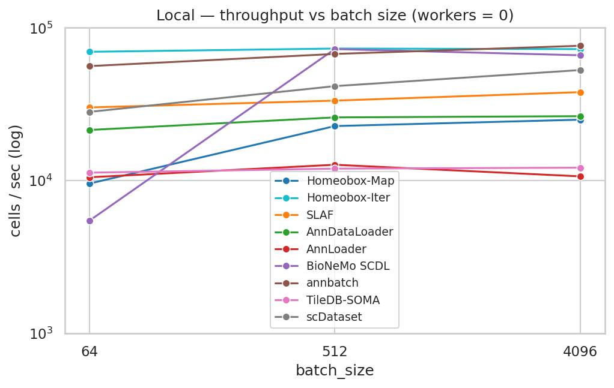
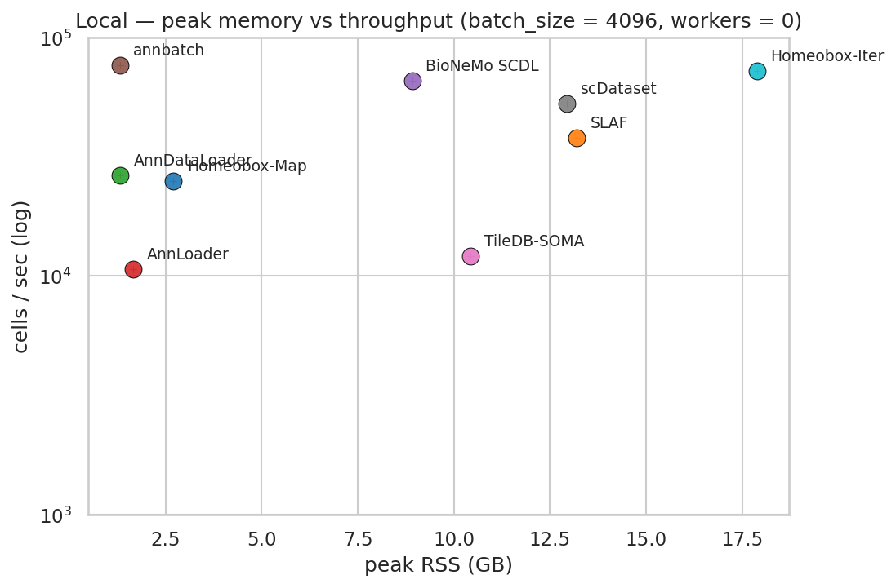
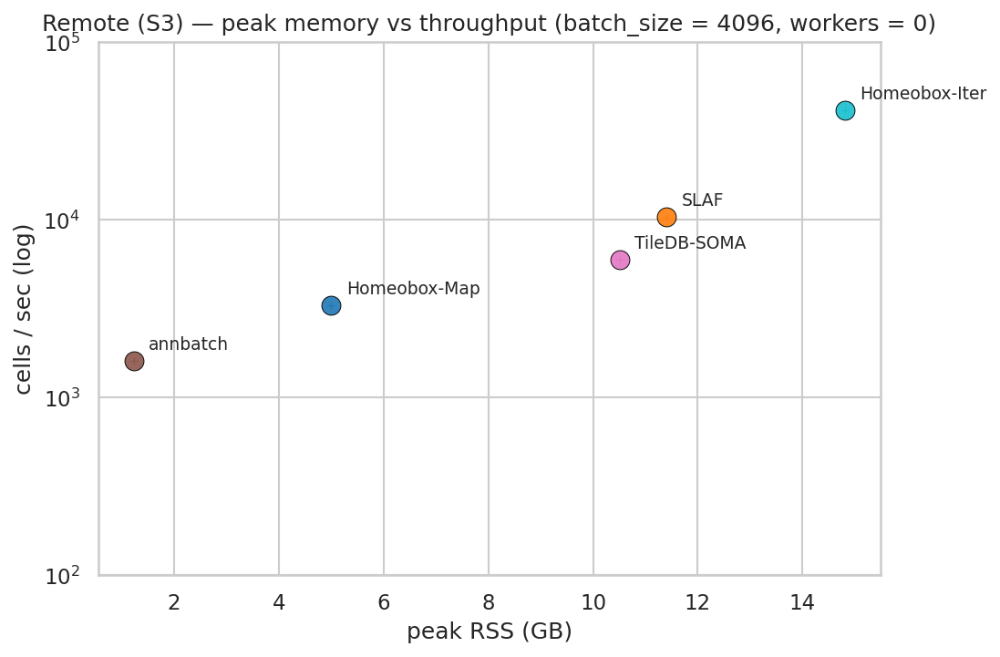
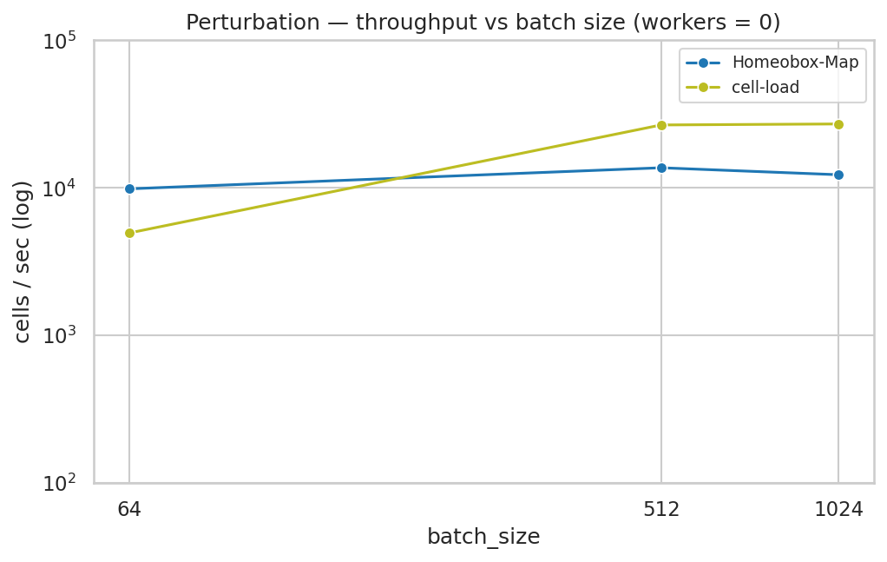
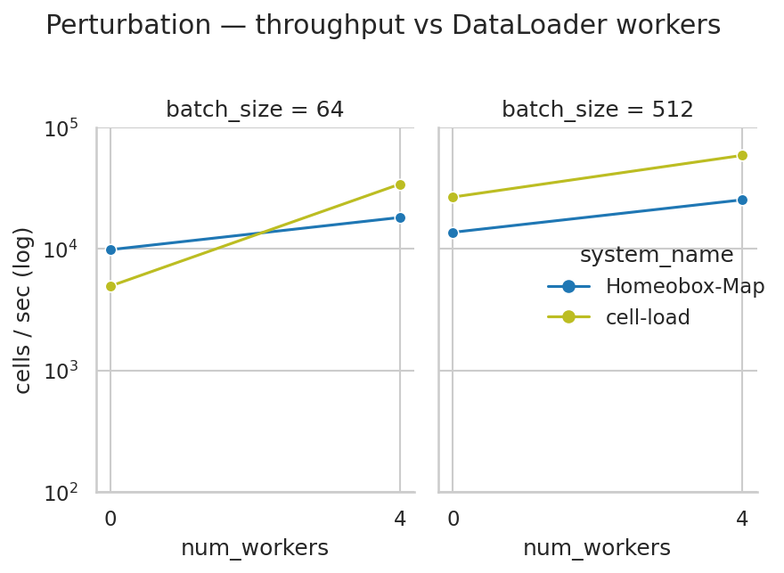
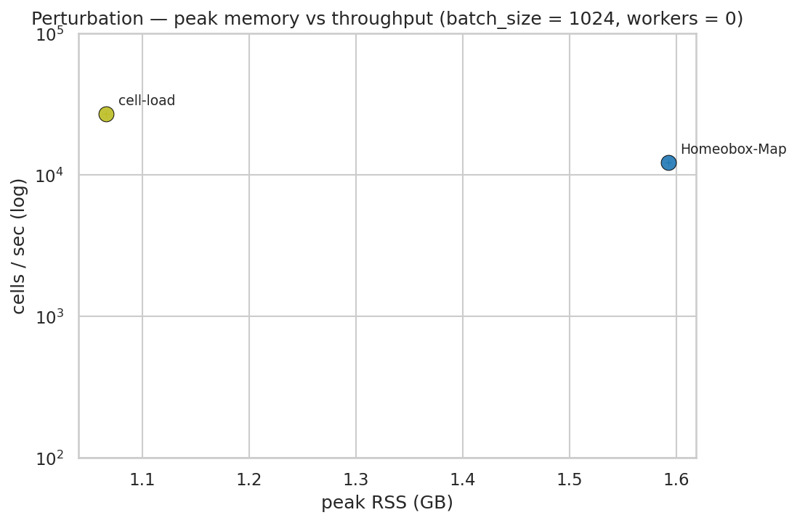

# ML Dataloader Benchmarks

Homeobox is designed to serve PyTorch training loops directly out of its zarr-backed atlas. To make claims about throughput meaningful, we compare it against a variety a commonly used dataloaders in both local and remote settings. The current benchmarks focus on single cell gene expression data, we will expand to consider other modalities like image data in the future.

The benchmarking scripts and methodology were copied and modified from [SLAF](`https://github.com/slaf-project/slaf/tree/d002bd72ff77f00b7d8fa3af8c4230543694d316/benchmarks`).

**DISCLAIMER:** Fairly comparing dataloading methods is challenging. Data shuffling and entropy are inconsistent, some datasets support multiple workers with multiprocessing and others use prefetching threads, some only support local data stores or hold cached copies of the data in memory, hyparameter tuning for the system and dataset may be required, etc. We provide the scripts so that anyone can experiment and compare on their own systems and datasets.

---

## Metrics

We measure **sustained cells per second** delivered to the training loop after a per-system warmup. Memory is recorded as **peak RSS** across the benchmarked process and all of its spawn children, sampled at 10 Hz.

Throughput is what training loops care about — a model step cannot start until the next batch is materialised, so the dataloader's steady-state rate is the upper bound on epochs per wall-hour.

We deliberately do **not** measure:

- **First-batch latency** — irrelevant for long training runs and dominated by import / open / mmap costs that no system optimises hard.
- **GPU-side preprocessing** — the systems compared here disagree on what counts as a batch (CSR vs. dense vs. tokenized), so we stop at "raw data delivered to Python."
- **Cold-disk read rates** — see the section on [page-cache priming](#page-cache-priming) below.

---

## Dataset

The benchmark suite uses two synthetic datasets, generated with deterministic seeds so a sweep can be reproduced bit-for-bit. The **throughput dataset** is the workhorse — sparse counts at atlas scale, exercised under both local and remote storage. The **perturbation dataset** is a separate, smaller workload that exists to stress the random-read access pattern used in single-cell perturbation training.

### Throughput dataset (local + remote)

All local- and remote-throughput dataloader runs read the same synthetic dataset, generated once by `benchmarks/make_synth_dataset.py` and converted into each system's native on-disk format:

| Property | Value |
|---|---|
| Cells | 1,000,000 |
| Genes | 20,000 |
| Density | 7% |
| Non-zero entries | ~1.4 billion |
| Values | `uint32` counts, drawn from `1 + Geometric(p=0.3)` |
| Total on disk | ~32 GB across all formats |

Each system reads its own copy, generated from the same underlying CSR shards. On-disk sizes vary by an order of magnitude across formats — the same logical 1M × 20k × 7% matrix occupies 2.5 GB in homeobox's bitpacked sharded zarr versus 11.3 GB in zstd-compressed h5ad, which is one of the things the benchmark *implicitly* measures (page-cache pressure, byte-rate ceilings on remote storage).

| Path | Reader | Size on disk |
|---|---|---:|
| `atlas/` | Homeobox `RaggedAtlas` | 2.5 GB |
| `slaf/` | SLAF (Lance) | 3.6 GB |
| `h5ad/synth.h5ad` | scDataset, scvi-tools `AnnDataLoader`, `anndata.experimental.AnnLoader` | 11.3 GB |
| `scdl/` | BioNeMo `SingleCellMemMapDataset` | 8.4 GB |
| `annbatch/dataset_*.zarr` | annbatch | 3.0 GB |
| `tiledbsoma/` | TileDB-SOMA `Experiment` | 2.9 GB |

Identical copies of the formats that support remote stores (Homeobox, SLAF, annbatch, TileDB-SOMA) were uploaded to S3 for the remote sweep.

The synthetic distribution matches the *shape* of single-cell count data (sparsity, integer counts, geometric tail) but does not impose biological structure.

### Perturbation dataset (group-aware random reads)

A separate dataset, built by `benchmarks/make_perturbation_synth.py`, targets the random-access workload that single-cell perturbation training imposes: each batch contains cells from one `(cell_type, gene)` group, which means the dataloader materialises rows that are scattered across the file rather than reading a contiguous slice.

| Property | Value |
|---|---|
| Cells | 1,000,000 |
| Features (HVG embedding) | 2,000 |
| Cell types | 10 (one shard each) |
| Perturbations | 50 (49 + 1 `non-targeting` control) |
| Groups | 500 × ~2,000 cells per `(cell_type, gene)` |
| Values | `float32`, drawn from `Normal(0, 1)` (embedding-like, dense) |
| Total on disk | ~22 GB across both views |

| Path | Reader | Size on disk |
|---|---|---:|
| `atlas/` | Homeobox `RaggedAtlas` with a group sampler | 7.0 GB |
| `cell_load/synth/CT*.h5` | `cell-load` (one AnnData per cell type) | 15 GB |

Cells are **deliberately shuffled within each shard** before being written. Real perturbation experiments don't store cells contiguously by `(cell_type, gene)`; without the shuffle, both backends would degenerate to sequential reads within a batch — the easy case — and storage-layout differences (zarr chunk layout, HDF5 dataspace ordering) would be hidden.

Only two systems target this workload in the current sweep: **Homeobox-Map** (random row reads via `BatchArray` plus a group-aware batch sampler) and **cell-load** (the Arc Institute perturbation loader, designed for exactly this access pattern). The other systems in the throughput suite do not support group-aware batching out of the box. The perturbation sweep is local-only because cell-load can't read from remote storage.

---

## Systems compared

### Homeobox-Map vs Homeobox-Iter

Homeobox exposes the same on-disk atlas through two PyTorch dataset surfaces, and the benchmark treats them as separate systems because the trade-off between them is the central design point of homeobox as a dataloader. **Both shuffle the full atlas uniformly at random each epoch** — the difference is the unit of I/O, not the access pattern:

- **Homeobox-Map** is a `torch.utils.data.Dataset` with `__getitem__(indices)`. Each training batch is one call into the `RustShardReader` for `batch_size` shuffled rows. Any sampler is allowed — including ones that aren't a simple permutation (group-aware perturbation samplers, fine-grained subsetting, anything custom).
- **Homeobox-Iter** is a `torch.utils.data.IterableDataset` that requests `io_batch_size=65,536` shuffled rows per call into the same reader and slices training batches out of an in-memory queue filled by a background prefetcher. Both the shuffle and the underlying zarr reads are scattered; the win is that each Python/Rust round-trip pulls 65k rows instead of `batch_size`, so the per-call fixed cost amortizes and the reader has more indices in hand to coalesce. The cost is that the sampler is fixed to "permutation, sliced into blocks" — group-aware samplers don't apply.

In short: **Homeobox-Map trades speed for sampler flexibility**, and **Homeobox-Iter trades sampler flexibility for speed**. As training `batch_size` grows, Map's per-batch fixed costs amortize over more cells and the Map-vs-Iter gap narrows — see [Results](#results).

### Systems table

| System | Library | What it reads |
|---|---|---|
| **Homeobox-Map** | `homeobox` (SUT) | Sharded zarr via `RustShardReader`, CSR `SparseBatch`, map-style with scattered per-cell reads per batch |
| **Homeobox-Iter** | `homeobox` (SUT) | Sharded zarr via `RustShardReader`, CSR `SparseBatch`, iterable with a 65k-row prefetched I/O block (scattered indices under shuffle, not on-disk contiguous) |
| SLAF | `slaf` | Lance dataset, raw CSR |
| scDataset | `scdataset` + `anndata` | Backed `.h5ad` via `AnnCollection` |
| AnnDataLoader | `scvi-tools` | Backed `.h5ad` |
| AnnLoader | `anndata.experimental` | Backed `.h5ad` |
| BioNeMo SCDL | `bionemo.scdl` | `SingleCellMemMapDataset` (memmap) |
| annbatch | `annbatch` | Zarr shards, optional `zarrs` codec |
| TileDB-SOMA | `tiledbsoma_ml` | TileDB-SOMA `Experiment` (sparse) |
| cell-load | `cell_load` | `PerturbationDataModule` (dense) |

### Capability matrix

Beyond raw throughput, these systems differ in what they can do at all. The table below is meant to help frame the throughput numbers in the right context — a system that can't read from S3 isn't directly comparable to one that can, even if its local-disk numbers look similar.

| System | Map-style[^map] | Remote storage | Training-only format[^tof] | Versioned snapshots | Ragged features[^rag] |
|---|:-:|:-:|:-:|:-:|:-:|
| **Homeobox-Map** | ✓ | ✓ | – | ✓ | ✓ |
| **Homeobox-Iter** | – | ✓ | – | ✓ | ✓ |
| SLAF | – | ✓ | – | ✓ | – |
| scDataset | – | – | – | – | – |
| AnnDataLoader | ✓ | – | – | – | – |
| AnnLoader | ✓ | – | – | – | – |
| BioNeMo SCDL | ✓ | – | ✓ | – | – |
| annbatch | – | ✓ | ✓ | – | – |
| TileDB-SOMA | – | ✓ | – | ✓ | – |
| cell-load | – | – | ✓ | – | – |

Torch-worker support varies across these systems but the rules are too noisy to capture in a column — see [`num_workers` support](#num_workers-support) for the per-system breakdown.

[^map]: **Map-style** means the dataset exposes `__getitem__(idx)` so PyTorch's `DataLoader` can dispatch any index to any worker independently. Iterable systems run a single producer that fans batches out — their multi-worker scaling depends on partitioning, not on worker-side parallelism.

[^tof]: **Training-only format** means the data must be re-materialised into an on-disk layout that exists exclusively to feed a training loop. A ✓ here is a cost, not a feature: you maintain two copies of the data, and the training copy can't be queried or inspected with the same tools as your analytical store.

[^rag]: **Ragged features** means datasets with different feature sets (different gene panels, additional modalities) can coexist in the store without padding to a union or intersecting to common features. Most systems require feature alignment upfront.

---

## Hardware and software

| Component | Value |
|---|---|
| CPU | Intel Xeon 6975P-C, 8 physical cores |
| RAM | ~130 GB |
| Storage | Local NVMe SSD (ext4) |
| OS | Ubuntu 24.04 |
| Python | 3.13 |
| PyTorch | from the homeobox `[ml]` extra |

The dataset fits entirely in page cache (~30 GB vs. ~130 GB RAM), see below.

---

## Measurement protocol

### Per-system harness

For each system, the harness:

1. Constructs the loader with the requested `batch_size` and `num_workers`.
2. Iterates 15 batches and discards them — a fast in-Python warmup that absorbs JIT, lazy-init, and first-touch costs internal to the loader.
3. Enters a fixed-duration loop: `warmup_seconds=10` of unmeasured iteration to let the worker pipeline reach steady state, followed by `measure_seconds=30` during which cells are counted.
4. Throughput is reported as `total_cells / measure_seconds`.

A background thread samples `psutil` RSS across the parent and all spawn children at 10 Hz; the maximum observed value is reported as peak memory.

### Subprocess isolation

Each system runs in its own subprocess invocation of the benchmark script (`--isolate`, default). This serves two purposes:

- **Per-system peak RSS is clean** — no residual heap from earlier systems' imports or buffers.
- **No cross-library interference** — some systems install global Python multiprocessing start methods or hold module-level caches that would otherwise persist.

The parent harness collects each child's JSON result, augments it with `(batch_size, num_workers, run_idx)`, and appends one row per system to a single CSV.

---

## Sweep grid

The benchmark suite runs two independent sweeps, each producing its own CSV.

### Throughput sweep (`benchmarks/sweep_dataloaders.py`)

Covers all systems against the [throughput dataset](#throughput-dataset-local--remote). One sweep produces one CSV.

- **Batch size:** 64, 512, 4096
- **`num_workers`:** 0, 4
- **Systems:** all (see [Systems table](#systems-table)); the harness auto-skips systems × configs that don't apply (see below).

### Perturbation sweep (`benchmarks/sweep_group_sampler.py`)

Covers Homeobox-Map and cell-load against the [perturbation dataset](#perturbation-dataset-group-aware-random-reads).

- **Batch size:** 64, 512, 1024
- **`num_workers`:** 0, 4
- **Systems:** Homeobox-Map, cell-load (the throughput-suite systems do not implement a group-aware sampler).
- The harness runs `(workers, batch_size)` as the *outer* product and alternates systems on the inner axis so each pair runs back-to-back under the same page-cache state.

### `num_workers` support

Not every system accepts torch-style multi-process workers. The sweeps auto-skip systems that don't, rather than running the `num_workers > 0` cell as a duplicate `num_workers = 0` measurement under a different label:

| System | `num_workers > 0` |
|---|---|
| Homeobox-Map | ✓ |
| Homeobox-Iter | — internal multithreaded prefetcher; running on top of `DataLoader` workers would double up |
| scDataset | ✓ |
| BioNeMo SCDL | ✓ |
| cell-load | ✓ |
| SLAF | — manages its own scanner threads (`n_scanners`) |
| annbatch | — own threaded preloader, no `num_workers` argument |
| AnnDataLoader, AnnLoader | — backed-h5ad pickling is unreliable across workers |
| TileDB-SOMA | — `ExperimentDataset` rejects `num_workers > 0` with `return_sparse_X=True` ([pytorch/pytorch#20248](https://github.com/pytorch/pytorch/issues/20248)) |

Systems in the second group contribute only the `num_workers = 0` rows. Plots showing scaling with `num_workers` therefore only carry curves for systems in the first group.

---

## Page-cache priming

The first time a benchmark process reads a system's files, it pays a cold-disk read latency that has nothing to do with the loader's design. The second time, all of that data is in the Linux page cache and reads run from RAM at memory speed. Because the full dataset (~30 GB) fits comfortably in page cache (~130 GB), the realistic sustained-training scenario is the warm one — after the first epoch, every subsequent epoch hits cache.

We do not attempt to drop the page cache between reps — it would require root, and a cold-disk benchmark is a different experiment (a disk benchmark, not a dataloader benchmark). If you want to study cold-start behavior, run the sweep with `--skip-primer` and look at rep 0 in isolation; expect substantial run-to-run noise that reflects storage hardware, not loader code.

---

## CSV output

The harness writes one CSV at `<output-csv>` with one row per `(system, batch_size, num_workers, run_idx)` measurement. Columns:

```
system_name, throughput_cells_per_sec, memory_usage_gb,
processes, measurement_time, total_cells, batch_count,
batch_size, num_workers, run_idx
```

`processes` is the worker process count actually used (`max(1, num_workers)` for systems that respect the argument). `measurement_time` is the wall-clock duration of the measurement window, which should be close to `measure_seconds` but is not exactly equal because the loop only checks the deadline between batches.

---

## Reproducing

### Throughput sweep

```bash
python benchmarks/make_synth_dataset.py --data-root /path/to/synth

python benchmarks/sweep_dataloaders.py \
    --data-root /path/to/synth \
    --output-csv profiles/dataloader_sweep.csv \
    --workers 0 4 \
    --batch-sizes 64 512 4096 \
    --reps 1
```

To benchmark a single system at a single configuration (useful when tuning):

```bash
python benchmarks/benchmark_dataloaders_homeobox.py \
    --data-root /path/to/synth \
    --batch-size 512 --num-workers 4 \
    --only homeobox \
    --output-csv /tmp/one.csv
```

### Perturbation sweep

```bash
python benchmarks/make_perturbation_synth.py --data-root /path/to/pertsynth_shuffled

python benchmarks/sweep_group_sampler.py \
    --data-root /path/to/pertsynth_shuffled \
    --output-csv profiles/group_sampler_sweep.csv \
    --systems homeobox cell-load \
    --workers 0 4 \
    --batch-sizes 64 512 1024 \
    --reps 1
```

### Rendering the figures

The plots in [Results](#results) below are generated by a marimo notebook that reads the CSVs in `profiles/` and writes PNGs to `docs/assets/`:

```bash
uv run marimo edit benchmarks/plot_dataloader_sweep.py   # interactive
uv run python benchmarks/plot_dataloader_sweep.py        # script-mode regeneration
```

---

## Results

All numbers below come from the reference hardware ([Hardware and software](#hardware-and-software)) with the page cache primed. Throughput is sustained cells/sec at steady state. The figures average across whatever reps are present in the CSV; the current snapshots are single-rep, so the markers and tables match the raw measurements one-for-one.

The recurring theme across all three sections is **the Homeobox-Map ↔ Homeobox-Iter trade-off**. Both shuffle the atlas uniformly at random. Map asks for `batch_size` shuffled rows per call into the Rust reader, Iter asks for 65k. Reading the same atlas under the same shuffle, **the gap between them is a direct measure of the per-call fixed cost Map pays for sampler flexibility**. That gap shrinks as `batch_size` grows: larger batches amortize Map's per-batch overhead over more rows and give the reader more indices per call to coalesce — both of which Iter already gets for free with its 65k-row block.

### Local — throughput on NVMe

All systems, `num_workers ∈ {0}`, all three batch sizes.



Throughput (cells/sec, `workers=0`, single rep):

| System | b=64 | b=512 | b=4096 |
|---|---:|---:|---:|
| **Homeobox-Iter** | 69,658 | 73,171 | 72,548 |
| annbatch | 56,154 | 67,459 | 76,314 |
| BioNeMo SCDL | 5,455 | 72,570 | 66,124 |
| scDataset | 28,151 | 41,525 | 52,923 |
| SLAF | 30,118 | 33,374 | 37,940 |
| AnnDataLoader | 21,446 | 25,926 | 26,403 |
| **Homeobox-Map** | 9,553 | 22,749 | 25,049 |
| TileDB-SOMA | 11,268 | 11,972 | 12,153 |
| AnnLoader | 10,509 | 12,699 | 10,656 |

Three things to notice:

1. **Homeobox-Iter saturates the reference NVMe at ~70k cells/sec** and is essentially flat across batch sizes — once the prefetcher is in steady state, the training-loop batch size doesn't matter, because the I/O unit is the 65k-row block and the training batches are sliced out of a warm queue. The only systems that get close are annbatch (chunk-prefetching zarr) and BioNeMo SCDL at large batches (memmap with bulk slicing).
2. **Homeobox-Map's gap to Homeobox-Iter narrows sharply with batch size.** At `b=64` Iter is 7.3× faster than Map (69,658 vs 9,553); at `b=512` it's 3.2× (73,171 vs 22,749); at `b=4096` it's 2.9× (72,548 vs 25,049). Exactly the amortization effect predicted above: at large `B`, Map's per-batch fixed overhead is divided over more rows, and the reader receives a wider index set per call so it can coalesce more zarr ranges — which is what Iter is effectively doing all the time with its 65k-row blocks.



On memory: Homeobox-Map sits in the low-RSS cluster (~1–3 GB at `b=4096, workers=0`), comparable to annbatch and AnnDataLoader. Homeobox-Iter pays for its in-memory prefetch queue with ~18 GB peak — the trade-off is again explicit. BioNeMo SCDL and TileDB-SOMA dominate the memory axis (~9 and ~10 GB respectively) without buying corresponding throughput against the leading systems.

### Remote — same atlas served from S3

Only systems whose readers speak object-store URIs appear here: Homeobox-Map, Homeobox-Iter, SLAF, annbatch, TileDB-SOMA.


Throughput (cells/sec, `workers=0`):

| System | b=64 | b=512 | b=4096 |
|---|---:|---:|---:|
| **Homeobox-Iter** | 40,378 | 42,344 | 41,453 |
| SLAF | 3,611 | 4,233 | 10,320 |
| TileDB-SOMA | 5,873 | 5,845 | 5,945 |
| **Homeobox-Map** | 576 | 1,884 | 3,300 |
| annbatch | 1,050 | 1,314 | 1,594 |

S3 latency turns the Map ↔ Iter trade-off from a 3–7× gap into a 12–70× gap. Each Homeobox-Map batch issues `B` obstore GETs against S3, and the per-request RTT (~10–20 ms) dominates the actual byte transfer. Homeobox-Iter still does scattered reads, but it asks for 65,536 indices per call, so the reader can coalesce co-located indices into fewer GETs and overlap many in-flight requests against the same RTT budget — and decode runs ahead of the consumer in the background prefetcher. The fixed cost being amortized is the same as locally; remote storage just makes that fixed cost an order of magnitude larger, which is why the gap is correspondingly larger.



Memory-wise the picture is similar to local: Homeobox-Iter trades ~15 GB peak RSS (its prefetch queue) for an order-of-magnitude throughput advantage; Homeobox-Map sits near the bottom of the memory axis.

### Perturbation — group-aware random reads

Each batch is `B` cells drawn from a single `(cell_type, gene)` group on the [perturbation dataset](#perturbation-dataset-group-aware-random-reads). Only **Homeobox-Map** and **cell-load** appear — none of the throughput-suite systems implement a group-aware sampler, and Homeobox-Iter cannot serve this workload because the access pattern requires `__getitem__`.



Throughput (cells/sec, `workers=0`):

| System | b=64 | b=512 | b=1024 |
|---|---:|---:|---:|
| **Homeobox-Map** | 9,842 | 13,677 | 12,265 |
| cell-load | 4,936 | 26,678 | 27,096 |

The crossover at `b≥512` is the locality story: a single-group batch in cell-load maps to a contiguous-ish region in one cell-type-specific `.h5` (one large HDF5 read), whereas Homeobox-Map issues `B` independent zarr range reads regardless of how the batch is constructed. At `b=64`, the per-batch fixed cost dominates cell-load's HDF5 open/seek path and Homeobox-Map wins by ~2×; at `b≥512`, cell-load's bulk-read advantage takes over and it pulls ahead by roughly the same factor.



At `num_workers=4` both systems roughly double, preserving the same ordering: cell-load at 34–59k cells/sec, Homeobox-Map at 18–25k cells/sec.



Memory is comparable between the two systems at the largest batch (cell-load ~1.1 GB, Homeobox-Map ~1.6 GB at `b=1024, workers=0`). The reason this benchmark exists is not to show that Homeobox-Map "wins" — at large batches on this workload it doesn't — but to quantify the cost of one specific flexibility: arbitrary `__getitem__` over the atlas, with no second on-disk copy and no per-cell-type sharding requirement. If your training loop is dominated by sustained large-batch group reads on a single dense embedding modality, cell-load's specialized format is faster; if you also need random access, multi-modal queries, ragged feature spaces, or remote-store reads, Homeobox-Map is the system that can serve all of those from one atlas.