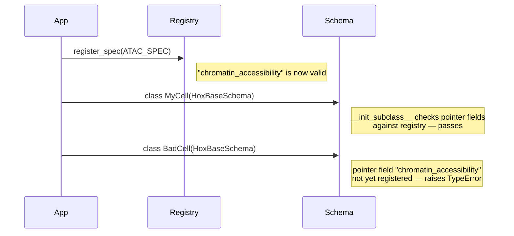

# Zarr Group Specs

A `ZarrGroupSpec` is a declaration: it tells homeobox what zarr arrays to expect inside a group. `FeatureSpaceSpec` binds that layout to a feature space, concrete pointer type, and reconstructor. Every feature space in the atlas must have a registered spec. Specs are validated at class-definition time — a `HoxBaseSchema` subclass that references a feature space without a registered spec will raise immediately.

```python
from homeobox.group_specs import (
    ZarrGroupSpec, FeatureSpaceSpec, LayersSpec, ArraySpec,
    register_spec, get_spec, registered_feature_spaces,
)
from homeobox.pointer_types import DenseZarrPointer, SparseZarrPointer
from homeobox.reconstruction import SparseCSRReconstructor, DenseFeatureReconstructor, FeatureCSCReconstructor
```

---

## Core concepts

### Pointer types

Each `FeatureSpaceSpec` declares the concrete pointer model stored on cell rows:

| Pointer type on cell rows | Typical use |
|---|---|---|
| `SparseZarrPointer` | High-dimensional sparse assays: gene expression, chromatin accessibility |
| `DenseZarrPointer` | Low-dimensional dense assays: protein panels, image embeddings |
| `DiscreteSpatialPointer` | N-D bounding boxes into an array, such as image crops |

The pointer type declared in the spec must match the pointer field types used in your `HoxBaseSchema` subclass. If a pointer field's annotation does not match `spec.pointer_type` (e.g. a `SparseZarrPointer` column declared with `PointerField.declare(feature_space=...)` pointing at a dense spec), `HoxBaseSchema.__init_subclass__` raises `TypeError` at class-definition time.

### ArraySpec

`ArraySpec` declares expected properties of a single zarr array:

| Field | Type | Description |
|---|---|---|
| `array_name` | `str` | Path of the array relative to the group root (e.g. `"csr/indices"`). |
| `dtype_kind` | `DTypeKind \| None` | Expected numeric category: `BOOL`, `SIGNED_INTEGER`, `UNSIGNED_INTEGER`, or `FLOAT`. `None` means any dtype is accepted. |
| `ndim` | `int \| None` | Expected number of dimensions. `None` means any dimensionality is accepted. |

### LayersSpec

`LayersSpec` declares the layers zarr subgroup for a feature space:

| Field | Type | Description |
|---|---|---|
| `prefix` | `str` | Path prefix before `layers/`. Empty string means `"layers/"` at the group root; `"csr"` means `"csr/layers/"`. |
| `match_shape_of` | `str \| None` | When set, every array in the layers subgroup must have the same shape as the sibling array named here (resolved relative to the parent group). |
| `axis_order` | `tuple[str, ...] \| None` | Optional axis names used to interpret layer shapes. Homeobox defines `SPATIAL_AXIS_ORDER = ("T", "C", "Z", "Y", "X")` and `IMAGE_TILE_AXIS_ORDER = ("N", "C", "Y", "X")`. Lower-rank arrays are interpreted as suffixes of the declared order, e.g. `("Y", "X")`, `("Z", "Y", "X")`, `("C", "Z", "Y", "X")`. |
| `shape_mismatch_axes` | `tuple[str, ...]` | Axis names that may differ between layer arrays. Empty by default, which requires exact shape equality. For spatial images this can be `("C",)` to allow different channel counts while keeping all other dimensions identical. |
| `required` | `list[str]` | Layer names that must exist in the layers subgroup. Also used as the default layers to read at query time. |
| `allowed` | `list[str]` | Whitelist of valid layer names for ingestion validation. |

The `path` property returns the resolved layers path: `f"{prefix}/layers"` if `prefix` is non-empty, otherwise `"layers"`.

Layer arrays must normally have identical shapes. When `shape_mismatch_axes` is set, arrays must still have the same rank, and only the named axes may differ. For the spatial `TCZYX` convention, a 3-D array is interpreted as `ZYX`, not `CYX`, so channel variability is available only for 4-D `CZYX` and 5-D `TCZYX` arrays.

---

## `ZarrGroupSpec` fields

`ZarrGroupSpec` is the top-level registration object. Each field controls a different aspect of how homeobox interacts with a feature space.

### `feature_space`

A string that must be unique across the spec registry. This value is used as the pointer field name in `HoxBaseSchema` subclasses and as the key for the feature registry table (when `has_var_df=True`). Choosing a stable, descriptive name matters: renaming a registered space after cells have been ingested requires migrating pointer field values in the cell table.

### `pointer_type`

`SparseZarrPointer`, `DenseZarrPointer`, or `DiscreteSpatialPointer`. Determines what row-pointer struct cells in this space carry and which ingestion/dataloader path handles them.

### `reconstructor`

A `Reconstructor` protocol instance. Controls how data is assembled back into query results. Common built-in options are:

- `SparseCSRReconstructor()` — for sparse assays stored in CSR layout. Reads byte ranges from `csr/indices` and the corresponding layer array, then scatter-gathers into the global feature space.
- `DenseFeatureReconstructor()` — for dense feature assays with `has_var_df=True`. Reads row slices from a dense 2-D array and scatters into the global feature space.
- `FeatureCSCReconstructor()` — for feature-filtered queries on sparse data. Requires that `add_csc()` has been called on the group; reads from `csc/indices` instead of `csr/indices`, enabling efficient column extraction without touching all cell rows.

See the Reconstructors page for guidance on choosing between these.

### `has_var_df`

`bool`. When `True`, this feature space has a feature registry table and entries in the `_feature_layouts` table (see [Feature Layouts](feature_layouts.md)). The registry table schema must be supplied to `RaggedAtlas.create()` via `registry_schemas`. Set to `False` for spaces with no stable feature axis — for example, arbitrary-length embedding vectors where the column count varies by dataset and no cross-dataset feature identity is meaningful.

### `required_arrays`

`list[ArraySpec]`. Arrays that must exist directly under the group root. The `validate_group` method checks that each named array is present and (if specified) has the right `dtype_kind` and `ndim`. Missing or mistyped arrays are reported as errors.

### `layers`

`LayersSpec`. Declares the layers subgroup: its path prefix, shape constraints, axis convention, required layers, and allowed layers. The `layers.path` property resolves the full subgroup path (e.g. `"csr/layers"` or `"layers"`). `layers.required` lists the layer names loaded by default at query time. `layers.allowed` is a whitelist for ingestion validation — attempting to ingest a layer whose name is not in this list raises an error.

---

## Built-in specs

Two specs are pre-registered in `homeobox.builtins`. They are imported automatically when `homeobox.builtins` is imported, which happens at package init.

### `GENE_EXPRESSION_SPEC`

```python
FeatureSpaceSpec(
    feature_space="gene_expression",
    pointer_type=SparseZarrPointer,
    has_var_df=True,
    reconstructor=SparseCSRReconstructor(),
    zarr_group_spec=ZarrGroupSpec(
        required_arrays=[ArraySpec(array_name="csr/indices", ndim=1, allowed_dtypes=[np.uint32])],
        layers=LayersSpec(
            prefix="csr",
            match_shape_of="csr/indices",
            required=[ArraySpec(array_name="counts", ndim=1, allowed_dtypes=[np.uint32])],
        ),
    ),
)
```

The `match_shape_of="csr/indices"` constraint on the layers subgroup ensures that every layer array has the same number of entries as the indices array — a prerequisite for correct CSR reads.

### `IMAGE_FEATURES_SPEC`

```python
FeatureSpaceSpec(
    feature_space="image_features",
    pointer_type=DenseZarrPointer,
    has_var_df=True,
    reconstructor=DenseFeatureReconstructor(),
    zarr_group_spec=ZarrGroupSpec(
        layers=LayersSpec(
            required=[ArraySpec(array_name="raw", ndim=2, allowed_dtypes=[np.float32])],
        ),
    ),
)
```

No `required_arrays` at the root because dense groups place everything under `layers/`.

---

## Defining a custom spec

Custom specs are the primary extension point. The pattern is: construct a `ZarrGroupSpec`, call `register_spec()`, then define any `HoxBaseSchema` subclass that uses it.

**`register_spec()` must be called before any `HoxBaseSchema` subclass that references the feature space is defined.** The pointer field validation happens at class-definition time, not at instantiation time.

### Dense custom spec

This example registers a `lognorm_rna` space for dense log-normalized RNA-seq data — the same spec used in the atlas walkthrough.

```python
from homeobox.group_specs import (
    ZarrGroupSpec, FeatureSpaceSpec, LayersSpec, ArraySpec, register_spec,
)
from homeobox.reconstruction import DenseFeatureReconstructor
from homeobox.pointer_types import DenseZarrPointer

LOGNORM_RNA_SPEC = FeatureSpaceSpec(
    feature_space="lognorm_rna",
    pointer_type=DenseZarrPointer,
    has_var_df=True,
    reconstructor=DenseFeatureReconstructor(),
    zarr_group_spec=ZarrGroupSpec(
        layers=LayersSpec(
            required=[ArraySpec(array_name="log_normalized", ndim=2, allowed_dtypes=[np.float32])],
        ),
    ),
)
register_spec(LOGNORM_RNA_SPEC)
```

After this call, `"lognorm_rna"` is a valid pointer field name for any `HoxBaseSchema` subclass defined in the same process.

### Sparse custom spec

For sparse data such as chromatin accessibility, mirror the structure of `GENE_EXPRESSION_SPEC`:

```python
from homeobox.group_specs import ArraySpec, FeatureSpaceSpec, LayersSpec
from homeobox.reconstruction import SparseCSRReconstructor
from homeobox.pointer_types import SparseZarrPointer

ATAC_SPEC = FeatureSpaceSpec(
    feature_space="chromatin_accessibility",
    pointer_type=SparseZarrPointer,
    has_var_df=True,
    reconstructor=SparseCSRReconstructor(),
    zarr_group_spec=ZarrGroupSpec(
        required_arrays=[ArraySpec(array_name="csr/indices", ndim=1, allowed_dtypes=[np.uint32])],
        layers=LayersSpec(
            prefix="csr",
            match_shape_of="csr/indices",
            required=[ArraySpec(array_name="counts", ndim=1, allowed_dtypes=[np.uint32])],
        ),
    ),
)
register_spec(ATAC_SPEC)
```

### Ordering requirements



If `register_spec()` is called after the schema class is defined, the `TypeError` from the schema definition will have already propagated. The fix is always to move `register_spec()` earlier in the module load order, typically in a dedicated `specs.py` module that is imported before any schema module.

---

## Querying the registry

Two utility functions inspect the live registry:

```python
from homeobox.group_specs import get_spec, registered_feature_spaces

registered_feature_spaces()
# {'gene_expression', 'image_features', 'lognorm_rna', 'chromatin_accessibility', ...}

spec = get_spec("gene_expression")
# FeatureSpaceSpec(feature_space='gene_expression', pointer_type=<class 'homeobox.schema.SparseZarrPointer'>, ...)
```

`get_spec()` raises `KeyError` if the named space is not registered. Use `registered_feature_spaces()` to check membership before calling `get_spec()` in code that handles unknown spaces.

---

## Group validation

`ZarrGroupSpec.validate_group(group)` returns a list of error strings — empty if the group satisfies all constraints declared by the spec. This is called internally by `atlas.validate()` but can also be used during development to verify a group before ingestion.

```python
import zarr

group = zarr.open_group("/path/to/group")
errors = spec.validate_group(group)
if errors:
    for e in errors:
        print(e)
```

Typical errors include missing arrays, wrong `ndim`, wrong `dtype_kind`, a missing subgroup, arrays within a subgroup with mismatched shapes, and a layer array whose shape does not match the required sibling array. Validation does not load any array data — it only inspects zarr metadata, so it is fast even for large remote groups.
