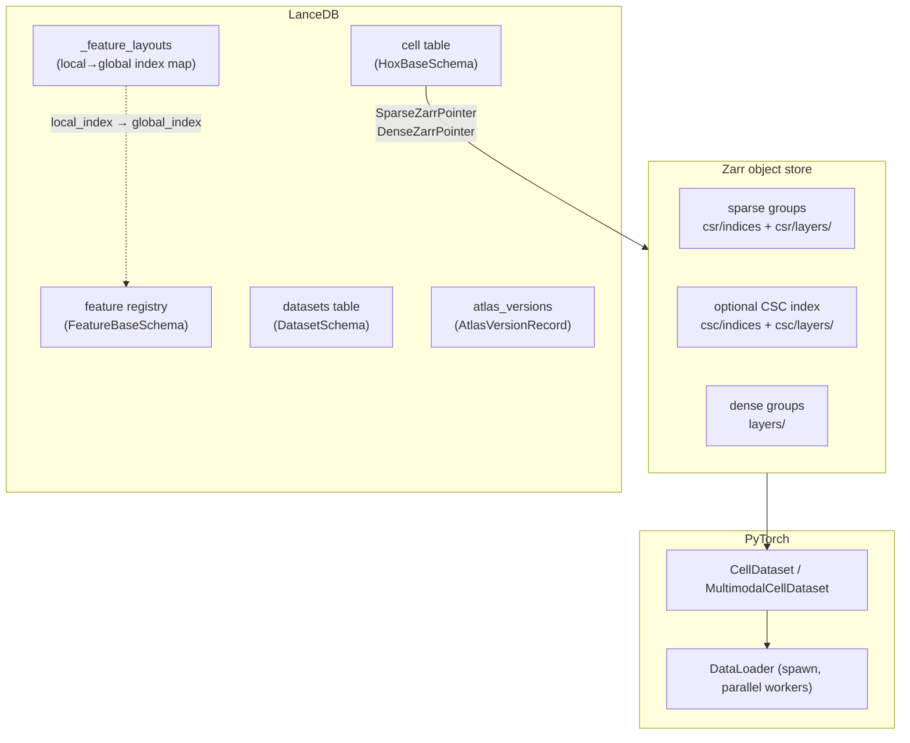

# homeobox

Homeobox is a multimodal database built for interactive analysis and ML training at scale. It combines the search and versioning capabilities of [LanceDB](https://lancedb.com) with the efficient and scalable storage of array data (count matrices, images and features) in [Zarr](https://zarr.dev).

A central design goal is to make it practical to train foundation models on collections of heterogeneous datasets without creating intermediate copies optimized only for ML. For example, a single homeobox dataloader can stream batches of text, (2,3,4)D image crops, sparse single cell gene expression matrices, plus 3D biomolecular structures and their corresponding sequences.

---

## Why homeobox

### Motivating cases

- A collection of hundreds or thousands of `h5ad` or `h5mu` files from different assays, panels, and organisms.
- A repository of large images stored in Zarr or OME-Zarr, DICOM, tiff, etc. Possibly, 2D, 3D, or 4D and > 1 TB each and associated with text descriptions.
- Single cell images, masks, and associated feature data (e.g., CellProfiler vectors).
- A combination of all-of-the-above

These cases are common and becoming harder to manage. Existing solutions tend to focus on single large datasets from one modality, often with a laborious standardization process that may involve bifurcating or dropping data to harmonize it. The `RaggedAtlas` concept introduced by homeobox, makes it possible to unify messy data into a single database that supports search, interactive data loading, and streaming for ML training.

### Ragged feature spaces, unified metadata tables

Conventional atlases have a single structured feature space, like a 2D cell-by-gene matrix. A ragged atlas, defines a feature space per dataset. In homeobox, we define a feature registry, which is a manifest of all features that appear across datasets. Each dataset is a separate zarr group with an associated feature layout. At query time, we remap the features in each zarr group into the global feature space defined by the feature registry either by taking the union across all queried groups or the intersection. This means that ingestion never requires dropping features and there is no ambiguity about whether a feature is a true zero or padding.

The `RaggedAtlas` is like an AnnData with a shared `obs` but arbitrary `var`. The `obs` component is stored in LanceDB and provides vector search, full text search, and scalar search indexes.

### Comparison to TileDB

- Single library works for everything
- Spec-driven design allows trivial extension of the library to new use cases
- `RaggedAtlas` flexibility
- Much better for random reads, which is critical for ML training.
- Deep integration with the python + rust data ecosystem: lance, duckdb, polars, zarrs.

### Querying across cells, modalities, and feature spaces

The cell table lives in LanceDB, so the full query surface is available without writing custom loaders: SQL predicates, vector similarity search (ANN), full-text search, and multi-column aggregations all work out of the box. You can count cell types, find nearest neighbors by embedding, filter by metadata, and load the result as AnnData or MuData in a single fluent chain.

```python
# Filter by metadata, load gene expression as AnnData
adata = atlas_r.query().where("tissue = 'lung' AND cell_type IS NOT NULL").to_anndata()

# Retrieve the 50 cells most similar to a query embedding
hits = atlas_r.query().search(query_vec, vector_column_name="embedding").limit(50).to_anndata()

# Load only a specific gene panel — uses the CSC index when available for minimal I/O
adata = atlas_r.query().features(["CD3D", "CD19", "MS4A1"], "gene_expression").to_anndata()
```

### Fast reads from cloud storage

Zarr's sharded storage format packs many chunks into a single object-store file. The shard index records each chunk's byte offset, enabling targeted range reads — but the Python zarr stack issues one HTTP request per chunk even when chunks can be coalesced.

Homeobox includes a Rust extension (`RustShardReader`) that handles shard reads manually: it batches all requested ranges, issues one `get_ranges` call per shard file (coalescing multiple chunks into as few network requests as possible), and decodes chunks in parallel using rayon. On remote object stores (S3, GCS, Azure), this typically cuts latency-dominated read time by an order of magnitude compared to sequential per-chunk fetches. The same reader backs both interactive queries and ML training — fast cloud reads are not a special mode, they are the default.

### BP-128 bitpacking

When ingesting integer data (`int32`, `int64`, `uint32`, `uint64`), homeobox feature space specs automatically use BP-128 bitpacking compression. In practice this delivers compression ratios comparable to the zarr default zstd on typical single-cell count matrices, while decoding at memory bandwidth speeds — making it strictly better than general-purpose codecs for this data type. 

### Map-style PyTorch datasets

Homeobox's `CellDataset` and `MultimodalCellDataset` are map-style PyTorch datasets that expose a `__getitem__` interface. This means PyTorch's `DataLoader` can dispatch any index to any worker process independently.

### Versioned snapshots

Homeobox separates the writable ingest path from the read/query path with an explicit snapshot model. You ingest freely, call `snapshot()` to record a consistent point-in-time view across all LanceDB table versions, then `checkout(version)` to open a read-only handle pinned to that snapshot. Queries and training runs execute against a frozen, reproducible view of the atlas — concurrent ingestion into the live atlas does not affect them.

---

## Architecture overview



---

## Installation

Prebuilt wheels are available on PyPI. Requires Python 3.13.

```bash
pip install homeobox          # core: atlas, querying, ingestion
pip install homeobox[ml]      # + PyTorch dataloader
pip install homeobox[bio]     # + scanpy, GEOparse
pip install homeobox[io]      # + S3/GCS/Azure, image codecs
pip install homeobox[viz]     # + marimo, matplotlib
pip install homeobox[all]     # everything
```

To build from source (requires a Rust toolchain):

```bash
curl -LsSf https://astral.sh/uv/install.sh | sh
curl --proto '=https' --tlsv1.2 -sSf https://sh.rustup.rs | sh
uv sync
maturin develop --release
```

---

## Documentation

### Concepts

- **[Data Structure](data_structure.md)** — the LanceDB + zarr layout, pointer types, `_feature_layouts` feature mapping, and versioning model.
- **[Building an Atlas](atlas.md)** — end-to-end walkthrough: register a spec, define schemas, ingest two datasets with different feature panels, snapshot, and run union/intersection queries.

### Reference

- **[Schemas](schemas.md)** — all LanceDB schema classes: `HoxBaseSchema`, `SparseZarrPointer`, `DenseZarrPointer`, `PointerField`, `FeatureBaseSchema`, `DatasetSchema`, `FeatureLayout`, `AtlasVersionRecord`. Covers the `uid`/`global_index` split and how pointer fields are declared and validated.
- **[Feature Layouts](feature_layouts.md)** — Python API for the `_feature_layouts` table: computing layout UIDs, building layout DataFrames, reindexing the registry, syncing global indices, and resolving feature UIDs to global positions.
- **[Group Specs](group_specs.md)** — `FeatureSpaceSpec`, `ZarrGroupSpec`, concrete pointer types, `ArraySpec`, `LayersSpec`, built-in specs, and how to define custom specs for new assay types.
- **[Querying](querying.md)** — the `AtlasQuery` fluent builder: filtering cells, controlling feature reconstruction, union/intersection joins, feature-filtered queries, and all terminal methods (`.to_anndata()`, `.to_mudata()`, `.to_batches()`, `.count()`).
- **[Reconstructors](reconstructors.md)** — `SparseCSRReconstructor`, `DenseFeatureReconstructor`, `FeatureCSCReconstructor`; choosing between them; the `Reconstructor` protocol for custom implementations.
- **[Array Storage](array_storage.md)** — `add_from_anndata` internals: streaming from backed `.h5ad` files, chunk/shard sizing, BP-128 bitpacking, the `_feature_layouts` feature mapping. Building the optional CSC column index with `add_csc()` for fast feature-filtered reads.
- **[PyTorch Data Loading](dataloader.md)** — `CellDataset` and `MultimodalCellDataset`; collate functions; `make_loader` with spawn parallelism.

---

## Quickstart

```python
import os
import numpy as np
import scanpy as sc
import homeobox as hox

# 1. Define schemas: one for gene features, one for cell metadata.
#    Each pointer column is declared with PointerField.declare, which
#    binds the column name to a registered feature_space.
class GeneFeature(hox.FeatureBaseSchema):
    gene_symbol: str

class CellSchema(hox.HoxBaseSchema):
    gene_expression: hox.SparseZarrPointer | None = hox.PointerField.declare(
        feature_space="gene_expression"
    )

# 2. Create an atlas
atlas_dir = "./hox_example_atlas/"
os.makedirs(atlas_dir, exist_ok=True)
atlas = hox.create_or_open_atlas(
    atlas_path=atlas_dir,
    obs_table_name="cells",
    obs_schema=CellSchema,
    dataset_table_name="datasets",
    dataset_schema=hox.DatasetSchema,
    registry_schemas={"gene_expression": GeneFeature},
)

# 3. Load a dataset and register its genes
adata = sc.datasets.pbmc3k()  # 2 700 PBMCs, raw counts, sparse CSR
adata.X = adata.X.astype(np.uint32)  # the counts layer must be np.uint32
features = [GeneFeature(uid=g, gene_symbol=g) for g in adata.var_names]
atlas.register_features("gene_expression", features)

# 4. Prepare var and ingest. `field_name` selects the cell-schema column
#    to populate; its feature_space is resolved from PointerField.declare.
adata.var["global_feature_uid"] = adata.var_names
record = hox.DatasetSchema(
    zarr_group="pbmc3k", feature_space="gene_expression", n_cells=adata.n_obs,
)
hox.add_from_anndata(
    atlas, adata, field_name="gene_expression",
    zarr_layer="counts", dataset_record=record,
)

# 5. Optimize tables and create a snapshot
atlas.optimize()
atlas.snapshot()

# 6. Open the atlas and query
atlas_r = hox.RaggedAtlas.checkout_latest(atlas_dir, obs_schema=CellSchema)
result = atlas_r.query().limit(500).to_anndata()
print(result)  # AnnData object with n_obs × n_vars = 500 × 32738
```

For a full walkthrough with two heterogeneous datasets, see [Building an Atlas](atlas.md).

## Ingesting image tiles

Not every modality fits in an AnnData. The built-in ``image_tiles`` feature
space stores a single 4D ``(n_cells, n_channels, H, W)`` array per dataset
with no feature registry. Ingestion is a few lines on top of
``atlas.create_zarr_group`` and the spec's ``create_array`` helper.

```python
import os
import numpy as np
import homeobox as hox
from homeobox.group_specs import get_spec

# 1. Schema with a single dense pointer into image_tiles.
class TileSchema(hox.HoxBaseSchema):
    image_tiles: hox.DenseZarrPointer | None = hox.PointerField.declare(
        feature_space="image_tiles"
    )

# 2. image_tiles has no feature registry, so registry_schemas is empty.
atlas_dir = "./hox_tile_atlas/"
os.makedirs(atlas_dir, exist_ok=True)
atlas = hox.create_or_open_atlas(
    atlas_path=atlas_dir,
    obs_table_name="cells",
    obs_schema=TileSchema,
    dataset_table_name="datasets",
    dataset_schema=hox.DatasetSchema,
    registry_schemas={},
)

# 3. Fabricate 128 random 5-channel, 96×96 uint8 tiles.
n_cells, n_channels, h, w = 128, 5, 96, 96
tiles = np.random.randint(0, 256, (n_cells, n_channels, h, w), dtype=np.uint8)

# 4. Register the dataset, create the zarr group, and write the 4D array.
#    The spec's create_array enforces ndim=4 and the allowed dtype set.
record = hox.DatasetSchema(
    zarr_group="random_tiles", feature_space="image_tiles", n_cells=n_cells,
)
atlas.register_dataset(record)
group = atlas.create_zarr_group(record.zarr_group)

spec = get_spec("image_tiles")
arr = spec.create_array(
    group, "data", shape=tiles.shape, dtype=np.uint8,
    chunks=(1, n_channels, h, w),
    shards=(64, n_channels, h, w),
)
arr[:] = tiles

# 5. Insert one cell row per tile with a DenseZarrPointer at that position.
rows = [
    TileSchema(
        dataset_uid=record.dataset_uid,
        image_tiles=hox.DenseZarrPointer(zarr_group=record.zarr_group, position=i),
    )
    for i in range(n_cells)
]
atlas.cell_table.add(rows)

atlas.optimize()
atlas.snapshot()

# 6. Query tiles back as a raw 4D array + obs DataFrame.
atlas_r = hox.RaggedAtlas.checkout_latest(atlas_dir, obs_schema=TileSchema)
tile_array, obs = atlas_r.query().to_array("image_tiles")
print(tile_array.shape, tile_array.dtype)  # (128, 5, 96, 96) uint8
```
