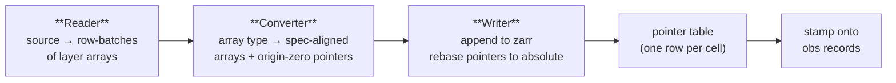

# Ingestion

Ingestion is the write path: it takes a source (an `AnnData`, a COO triplet file, a BED fragment file, …) and lands it in an atlas as **one zarr group of arrays plus one pointer per obs row**. It is the mirror image of [reconstruction](reconstructors.md) — where a reconstructor reads a feature space back into a modality-native object, ingestion writes a modality-native source into a feature space.

The design splits that work into three small, single-responsibility pieces resolved automatically from a feature space's [`FeatureSpaceSpec`](array_storage.md):



A reader streams a source as row-batches; a converter adapts each batch onto the arrays the spec wants; a writer owns the zarr group and the running offsets. Because the trio is resolved from the spec, **adding a feature space of an existing layout family usually needs no new ingestion code** — only the names change, and those are read from the spec.

On top of that streaming core sit two user-facing layers:

- The **`Ingestor`** engine, which decouples *writing a matrix* from *writing obs rows* so several matrices can populate one obs record (multimodal).
- A **functional API** (`ingest_dataset`, `add_from_anndata`, `ingest_multimodal`, `ingest_fragments`) for the common cases.

Everything below lives in `homeobox.ingestion`.

---

## The streaming core

### Readers

```python
from homeobox.ingestion import Reader, AnnDataReader, COOReader, FragmentReader
```

A `Reader` is a source adapter. Its one job is to emit row-batches of layer arrays:

```python
class Reader(Protocol):
    def iter_layer_batches(
        self, batch_size: int, layer_mapping: dict[str, str]
    ) -> Generator[dict[str, Any]]: ...
```

Each yielded batch is a `{target_layer: array}` dict where every layer shares one sparsity structure. `layer_mapping` maps the **source** layer names the reader should read to their **destination** layer names in the spec's `layers/` group (e.g. `{"X": "counts"}`, or `{"X": "counts", "spliced": "spliced"}` for a multi-layer write).

A reader is deliberately **spec-agnostic**: it decodes whatever source it wants and emits in row order. The array *type* it yields (a `csr_matrix`, a dense `ndarray`, a bespoke carrier) is what selects the converter downstream — so one reader works for any feature space of a compatible layout.

| Reader | Source | Emits |
|---|---|---|
| `AnnDataReader` | in-memory `AnnData` or `.h5ad` path (incl. `backed="r"`) | CSR / dense row-batches of `X` and/or `layers` |
| `COOReader` | cell-sorted `(feature, cell, value)` triplet file | CSR row-batches over the full `[0, n_rows)` row space |
| `FragmentReader` | BED fragment file / pre-parsed frame | `FragmentBatch` cell-batches for chromatin accessibility |

`COOReader` and `FragmentReader` show the pattern's reach: the cell-sorted invariant is load-bearing (both fail loudly on out-of-order input), but neither needs a bespoke writer — they decode into a structure an existing converter already understands.

### Converters

```python
from homeobox.ingestion import ArrayConverter, register_converter, converter_for
```

A converter is the adapter between **one in-memory array type** (CSR, dense, fragment intervals) and **one pointer-type layout family** (the sparse range layout, the dense row layout). It is *pure and per-batch*: given the layers of a single row-batch, `convert()` returns a dict of batch-relative arrays and **origin-zero** pointer fields — it knows nothing about how much has already been written.

```python
{
    "required_arrays": {...},   # structural arrays keyed by spec-declared name (e.g. "csr/indices")
    "layers":          {...},   # {layer_name: values} for each requested layer
    "pointer_fields":  {...},   # origin-zero pointer components (start/end/zarr_row, or position)
    "n_rows":          int,     # rows in this batch
}
```

A converter is **not** bound to a single feature space. What varies between feature spaces of the same family is only the *names* — the structural array name (`csr/indices` vs `gene/indices`), the layer names — and those are read from the spec, never hardcoded. The base class validates that a converter targets the spec's pointer type and emits exactly the fields that pointer type declares.

#### The converter registry

Converters are selected **by feature space**, not by pointer type — because two feature spaces can share a pointer type yet need entirely different layouts (gene expression and chromatin accessibility are both `SparseZarrPointer`, but one is a CSR value-layout and the other an interval layout). A small registry maps feature-space name → converter class:

```python
@register_converter("gene_expression")
class CSRSparseConverter(ArrayConverter): ...

converter = converter_for(spec, sample)   # resolve + validate input array type
```

`converter_for` raises rather than silently mis-mapping: an unregistered feature space, or a sample whose type doesn't match the converter's `input_type`, fails loudly.

| Converter | Feature spaces | Input type | Pointer type |
|---|---|---|---|
| `CSRSparseConverter` | `gene_expression` | `csr_matrix`, dense `ndarray` | `SparseZarrPointer` |
| `FragmentConverter` | `chromatin_accessibility` | `FragmentBatch` | `SparseZarrPointer` |
| `DenseConverter` | `image_features`, `protein_abundance` | dense `ndarray` | `DenseZarrPointer` |

Add a sparse feature space whose matrix is CSR and the existing `CSRSparseConverter` already handles it (bind it by name). Add a fundamentally new *layout* (fragments needed a `chromosomes` structural array and two value layers a `csr_matrix` can't carry) and you write a converter and register it.

### Writers

```python
from homeobox.ingestion import SparseZarrWriter, DenseZarrWriter, writer_for, write_feature_space
```

The writer owns the zarr group and the running offsets — it is the only piece that knows how much has already been written. It does the two things the reader and converter cannot:

1. **Appends** each batch's arrays into the (growable) zarr arrays.
2. **Rebases** the converter's origin-zero pointer fields into absolute coordinates by adding the relevant running counter.

Which counter rebases which field is declared on the pointer type (`pointer_type.offset_axes`), so the writer body stays generic across pointer types — it holds the counters, advances each by however much the subclass appended, and emits a pointer table whose columns are exactly the pointer type's fields plus `zarr_group`. Writers are resolved by pointer type:

```python
_WRITERS = {SparseZarrPointer: SparseZarrWriter, DenseZarrPointer: DenseZarrWriter}
writer = writer_for(spec, group, layer_names=..., **create_kwargs)
```

`write_feature_space` is the seam that drives all three together — resolve the writer (by pointer type) and, from the first batch, the converter (by array type), then stream:

```python
pointer_columns = write_feature_space(
    reader, spec, group,
    batch_size=..., layer_mapping=..., layer_names=..., zarr_group_name=...,
)
```

It returns the **pointer table**: a columnar dict (`zarr_group`, plus the pointer type's fields) with one row per cell, ready to be stamped onto the obs records. This is the boundary between "write the matrix" and "write the obs rows" — and the boundary the `Ingestor` exploits.

---

## The `Ingestor`

```python
from homeobox.ingestion import Ingestor
```

`write_feature_space` produces a pointer table; something has to register the dataset and stamp those pointers onto obs rows. For a single matrix that is one call. **Multimodal data breaks the single-call shape**: several matrices — each its own dataset record and zarr group, all sharing one `dataset_uid` — must populate *different pointer fields on the same obs rows*, and those rows must be inserted exactly once.

`Ingestor` splits the two steps:

- **`write_array(...)`** — does the per-matrix work (validate var, register the dataset, write the zarr group via `write_feature_space`, compute the pointer column) and **accumulates** the pointer struct keyed by its field. Call it once per feature space.
- **`write_obs_records()`** — builds one obs table from every accumulated pointer field — **null-filling** the pointer fields no pass wrote — and inserts it. Call it once.

obs columns and the obs table are validated **once, up front**, in the constructor, so a bad obs frame fails before any zarr is written.

```python
ingestor = Ingestor(atlas, obs_df=obs_df)            # obs validated here

ingestor.write_array(
    AnnDataReader(rna_adata),
    field_name="gene_expression",
    layer_mapping={"X": "counts"},
    dataset_record=DatasetSchema(dataset_uid=uid, zarr_group="ds0/rna", feature_space="gene_expression"),
    n_vars=rna_adata.n_vars, var_df=rna_adata.var,
)
ingestor.write_array(
    AnnDataReader(protein_adata),
    field_name="protein_abundance",
    layer_mapping={"X": "ctrl_standardized"},
    dataset_record=DatasetSchema(dataset_uid=uid, zarr_group="ds0/protein", feature_space="protein_abundance"),
    n_vars=protein_adata.n_vars, var_df=protein_adata.var,
)

n_cells = ingestor.write_obs_records()               # one obs record per cell, both fields populated
```

The engine enforces its invariants loudly: every `write_array` must share one `dataset_uid`; each reader must emit exactly `len(obs_df)` rows; a field can't be written twice; `write_array` after `write_obs_records` (or a second `write_obs_records`) raises — the ingestor is single-use. Heterogeneous modalities (here a sparse and a dense feature space, with different destination layers) are exactly what the per-call `layer_mapping` is for.

---

## The functional API

For the common cases you don't construct an `Ingestor` directly — these wrappers do it for you.

| Function | Use it for |
|---|---|
| `ingest_dataset(atlas, reader, ...)` | One feature space from any `Reader`. The shared spine: one `write_array` + one `write_obs_records`. |
| `add_from_anndata(atlas, adata, ...)` | The everyday case: ingest an `AnnData` (or `.h5ad` path, incl. `backed`). A thin source adapter over `ingest_dataset`. |
| `ingest_multimodal(atlas, modalities, ...)` | Several aligned `AnnData` modalities sharing one obs schema → one obs record per cell. Drives the `Ingestor` for you. |
| `ingest_fragments(atlas, ...)` | Chromatin-accessibility BED fragments (cell-sorted, row-oriented). |

### Ingesting an AnnData

The 90% case. Register the feature's registry schema, then stream `adata.X` into a named layer; the feature space is derived from the obs field's `PointerField`, and the spec decides whether a `var_df` is needed and which converter/writer apply.

```python
from homeobox.ingestion import add_from_anndata

add_from_anndata(
    atlas, adata,
    field_name="gene_expression",   # obs-schema pointer column to populate
    zarr_layer="counts",            # destination layer for adata.X
    dataset_record=DatasetSchema(zarr_group="ds1/gene_expression", feature_space="gene_expression"),
)
```

`layer_mapping={"spliced": "spliced"}` writes extra `adata.layers` alongside `X`; `backed="r"` streams the matrix off disk one batch at a time instead of reading it fully into memory.

### Ingesting aligned multimodal AnnData

`ingest_multimodal` is the convenience wrapper over `Ingestor` for the homogeneous case — modalities keyed by pointer field, each written to the **same** destination layer, all sharing one `dataset_uid`:

```python
from homeobox.ingestion import ingest_multimodal

uid = make_uid()
ingest_multimodal(
    atlas,
    {"img_a": adata_a, "img_b": adata_b},      # {field_name: AnnData}
    obs_df=obs_df,                              # shared obs, one row per cell
    zarr_layer="ctrl_standardized",
    dataset_records={
        "img_a": DatasetSchema(dataset_uid=uid, zarr_group="ds0/img_a", feature_space="image_features"),
        "img_b": DatasetSchema(dataset_uid=uid, zarr_group="ds0/img_b", feature_space="image_features"),
    },
)
```

It checks every modality's cell count against `len(obs_df)` up front, then loops `write_array` per modality and calls `write_obs_records` once. When modalities need **different** destination layers (a sparse + a dense feature space), reach past the wrapper and drive the `Ingestor` directly, as shown above.

### `var_df` and the feature registry

For feature spaces with `has_var_df=True` (gene expression, dense features, chromatin accessibility), each `write_array` validates the supplied `var_df` against that feature space's [registry schema](feature_registries.md) — exact column match, no duplicate uids — before registering the dataset. This is the link between ingestion and the feature registries: the registry defines the global feature vocabulary, and a dataset's `var_df` must speak it. `add_from_anndata` passes `adata.var` through automatically.

---

## Feature-oriented copies (post-ingestion)

The streaming path always writes the **row-oriented** copy: cells are the outer axis, so a per-cell pointer addresses a contiguous slice. Some feature spaces also support a **feature-oriented** copy for efficient feature-filtered or range queries. Those are built **after** ingestion as a separate, optional step — never in the same pass:

| Function | Builds | From |
|---|---|---|
| `add_csc(atlas, zarr_group, field_name)` | a CSC (feature-major) copy beside the CSR group | reads the CSR arrays back from zarr |
| `add_genome_sorted(atlas, zarr_group, field_name)` | the `genome_sorted/` arrays for fragment range queries | reads the cell-sorted arrays back from zarr |

Both follow the same shape as `add_csc`: read the row-oriented copy back out of zarr, transpose / re-sort, and write the feature-oriented copy alongside it, then invalidate the group's reader cache. Keeping this out of the ingest pass means the expensive, optional index is decoupled from the load-bearing write and can be (re)built at any time. So fragment ingestion is two calls — `ingest_fragments(...)` then, if you want range queries, `add_genome_sorted(...)`.

---

## Adding a feature space

The payoff of the spec-driven trio: most new feature spaces need **no ingestion code at all**. Declare a `FeatureSpaceSpec` (see [Array Storage](array_storage.md)), and:

- If its matrix is CSR/dense and its layout matches an existing converter's family, bind that converter to the new name with `@register_converter("your_space")` — done.
- If it introduces a genuinely new in-memory shape (as fragments did), write an `ArrayConverter` subclass and register it. The generic `SparseZarrWriter` / `DenseZarrWriter` usually still apply; a new *pointer type* is what would require a new writer in `_WRITERS`.

Reader, writer, and the obs-stamping path stay untouched — they were never feature-space-specific to begin with.
