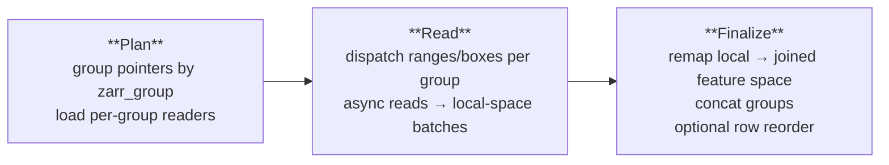

# Reconstructors

A reconstructor converts raw zarr data behind a feature space into a modality-native object such as an `AnnData`, `SpatialTileBatch`, or `FragmentResult`. Every [`FeatureSpaceSpec`](array_storage.md) carries a reconstructor instance, and `AtlasQuery` terminal methods like `.to_anndata()`, `.to_spatial_batch()`, and `.to_fragments()` dispatch to it. Homeobox ships built-in reconstructors for a few standard feature-space shapes. 

---

## The `Reconstructor` base class

```python
from homeobox.reconstructor_base import Reconstructor, endpoint
```

`Reconstructor` is a concrete base class. Subclasses declare what shape of data they handle and what user-facing endpoints they expose. The query layer enumerates endpoints (`Reconstructor.endpoints()`) so that `.to_anndata()` on a spatial-only feature space produces an informative error instead of a `NotImplementedError`.

**Class attributes** that participate in the shared I/O path (see [The shared I/O path](#the-shared-io-path) below):

- `required_arrays: list[str]` — structural zarr arrays the reconstructor needs in addition to layer arrays (e.g. `["csr/indices"]` for CSR readers).
- `require_var_df: bool` — `True` for reconstructors that join through a feature registry; `False` for var-less spaces like raw images.
- `read_method: Literal["ranges", "boxes"]` — `"ranges"` for byte-range reads against sparse CSR arrays; `"boxes"` for row/box reads against dense or spatial arrays.
- `stack_uniform: bool` — only meaningful when `read_method="boxes"`. Controls whether per-row reads are stacked into a single ndarray (dense features) or kept as a list (spatial tiles, where crop shapes vary).

**Endpoint methods** are marked with the `@endpoint` decorator. A reconstructor can declare any subset of `as_anndata`, `as_spatial_batch`, `as_fragments`; the chosen subset determines which `AtlasQuery.to_*` terminals are valid for the feature space.

**Pipeline hooks** that subclasses implement so the shared I/O path can drive them:

- `build_group_batch(group_reader, group_rows, layer_names, results)` — wraps one zarr group's raw read results into a local-space [`SparseBatch`](https://github.com/epiblastai/homeobox/blob/main/homeobox/batch_types.py) / `DenseFeatureBatch` / `SpatialTileBatch`.
- `build_empty_batch(...)` — the zero-row counterpart used when a query matches no rows.

---

## The shared I/O path

Every `as_anndata` / `as_spatial_batch` implementation — and the streaming dataloader — drives the same three-stage pipeline (defined in `homeobox/reconstruction_functional.py`):



1. **Plan** (`build_feature_read_plan`). Group the queried rows by `zarr_group` and resolve a `FeatureReadPlan` for the whole batch. The read plan includes the `FeatureSpaceSpec`, the structural and layer zarr array paths, the maximal per-layer dtype for consistent casting, the joined-feature-space width (`n_features`), and per-group `GroupReader`s and `LayoutReader`s.
2. **Read** (`read_arrays_by_group`). For each group, dispatch async reads keyed off `read_method`: `"ranges"` calls into the byte ranges produced by `spec.pointer_type.to_ranges(group_rows)`, `"boxes"` into `spec.pointer_type.to_boxes(group_rows)` (honoring `stack_uniform`). The reconstructor's `build_group_batch` wraps each group's raw results into a typed batch — still in the group's local feature order.
3. **Finalize** (`finalize_grouped_read`). Upcast layer arrays to the plan's resolved dtype, remap each group's local feature indices into the joined feature space, and concatenate. If a `target_row_ids` is passed, also reorder rows to match. The dataloader uses this to align rows to the sampler's order, general reconstruction methods like `as_anndata` leave it unset and accept zarr-group order.

The reconstructor then wraps the joined batch's `indices/offsets/layers` (or layer ndarrays / per-row lists) in `AnnData` / `SpatialTileBatch` / etc.

---

## Built-in reconstructors

| Reconstructor | Endpoint | `read_method` | When to use |
|---|---|---|---|
| `SparseGeneExpressionReconstructor` | `as_anndata` | `ranges` | Sparse var-df assays (gene expression, ATAC counts). Picks `SparseCSRReconstructor` or `FeatureCSCReconstructor` per query. |
| `DenseFeatureReconstructor` | `as_anndata` | `boxes` | Dense feature arrays with a registry — protein abundance, embeddings, log-normalized HVGs. Requires `has_var_df=True`. |
| `SpatialReconstructor` | `as_spatial_batch` | `boxes` | Var-less spatial fields (image tiles, image crops). Sets `stack_uniform=False` so each row's array keeps its native shape. |
| `IntervalReconstructor` | `as_fragments` | — | Fragment-based modalities (chromatin accessibility). Bespoke flow; doesn't use the shared pipeline. Defined in `homeobox.fragments.reconstruction`. |
| `SparseCSRReconstructor` | — (internal) | `ranges` | Building block. CSR byte-range reads. |
| `FeatureCSCReconstructor` | — (internal) | `ranges` | Building block. Per-feature column-slice reads against a feature-oriented (CSC) copy. |

### How sparse dispatch works

`SparseGeneExpressionReconstructor.as_anndata` chooses CSC vs CSR per query, in `_should_use_csc`:

- CSC is picked when (a) the query is feature-filtered (`wanted_globals is not None`), (b) the number of obs rows exceeds the number of requested features, and (c) every queried group has a feature-oriented CSC copy on disk.
- Otherwise — including mid-migration atlases where only some groups have been CSC-populated — it falls back to CSR.

Switching a feature space's reconstructor to `SparseGeneExpressionReconstructor` is the entry point; the CSR↔CSC heuristic is not user-tunable.

### Spatial batches

`SpatialReconstructor` is the only built-in that exposes `as_spatial_batch` rather than `as_anndata`. The returned [`SpatialTileBatch`](https://github.com/epiblastai/homeobox/blob/main/homeobox/batch_types.py) is list-backed: each layer holds one ndarray per present row, preserving native crop shapes. Stack uniform-shape crops at the call site with `np.stack(batch.layers[layer], axis=0)`.

**NOTE:** We eventually plan to support `to_spatialdata()` as an endpoint for some cases. `spatialdata` is an excessive representation for a list of image tiles without coordinate transformations or associated polygons and points.

---

## Implementing a custom reconstructor

Subclass `Reconstructor`, declare the class attributes, mark endpoint methods with `@endpoint`, and call the shared pipeline inside each endpoint:

```python
from homeobox.reconstructor_base import Reconstructor, endpoint
from homeobox.reconstruction_functional import (
    build_feature_read_plan,
    read_arrays_by_group,
    finalize_grouped_read,
)

class MyReconstructor(Reconstructor):
    required_arrays = ["..."]
    require_var_df = True
    read_method = "ranges"   # or "boxes"
    stack_uniform = True     # only for read_method == "boxes"

    def build_group_batch(self, group_reader, group_rows, layer_names, results):
        ...  # wrap raw read results in SparseBatch / DenseFeatureBatch / SpatialTileBatch

    def build_empty_batch(self, *, n_rows, n_features, layer_dtypes, layer_names):
        ...

    @endpoint
    def as_anndata(self, atlas, obs_pl, pf, layer_overrides=None,
                   feature_join="union", wanted_globals=None):
        plan = build_feature_read_plan(
            atlas, groups, pf,
            layer_overrides=layer_overrides,
            feature_join=feature_join,
            wanted_globals=wanted_globals,
        )
        group_batches = read_arrays_by_group(plan, groups)
        batch = finalize_grouped_read(plan, group_batches)
        # assemble AnnData / SpatialTileBatch / ... from `batch`
        ...
```

`SparseCSRReconstructor` (ranges, sparse) and `SpatialReconstructor` (boxes, `stack_uniform=False`) are the two minimal reference implementations to copy from.
