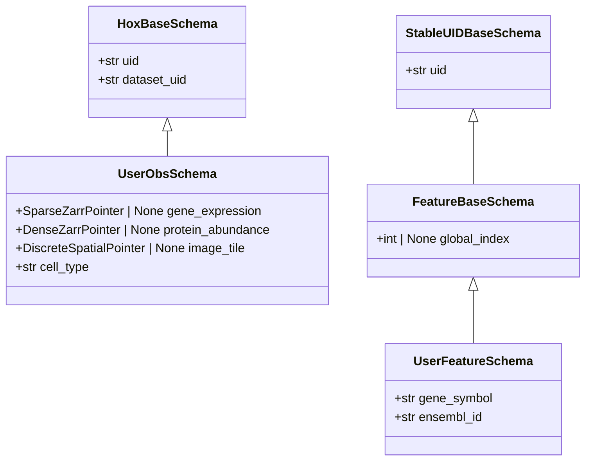

# Schemas

Every Lance table in a homeobox atlas is backed by a Pydantic schema class that subclasses LanceDB's `LanceModel`. These schemas are the ground-level contracts between application code and the database: they define what columns each table has, what types those columns hold, and which fields are optional or auto-populated.

There are two user-extensible families:

- **Obs schemas** — subclasses of `HoxBaseSchema`. One or more obs tables per atlas; rows represent whatever the table indexes (cells, nuclei, spatial tiles, image crops, perturbation conditions, donors, …). An atlas may declare many obs tables side by side, each with its own schema.
- **Feature schemas** — subclasses of `FeatureBaseSchema`. One table per feature space; rows represent features (genes, proteins, peaks, image-feature channels, …) that have a stable identity across datasets.

Three internal tables are also covered below: `DatasetSchema`, `FeatureLayout`, and `AtlasVersionRecord`. You interact with these indirectly during ingestion and versioning.

```python
from homeobox.schema import (
    HoxBaseSchema, FeatureBaseSchema, PointerField, StableUIDField, ForeignKeyField,
    PolymorphicForeignKeyField, OntologyAlignedField, CrossReferenceField,
    DatasetSchema, FeatureLayout, AtlasVersionRecord,
)
```

For the pointer types that obs schemas reference (`SparseZarrPointer`, `DenseZarrPointer`, `DiscreteSpatialPointer`), see [Pointer types](pointer_types.md).

---

## Inheritance hierarchy



---

## `HoxBaseSchema`

`HoxBaseSchema` is the base class for obs tables. Every row in an obs table is an instance of a subclass of this class.

### Auto-populated fields

| Field | Type | Description |
|---|---|---|
| `uid` | `str` | 16-character random hex string, generated by `make_uid()` (which calls `uuid4().hex[:16]`). Unique per row. Safe for concurrent writers because generation needs no coordination. |
| `dataset_uid` | `str` | Filled automatically by the ingestion layer to match the `dataset_uid` of the `DatasetSchema` the row was ingested with. Do not set manually. |

Both are defined on the base class and should not be redeclared in subclasses.

### Pointer fields

A pointer field tells the atlas that rows in this obs table may be measured in a given feature space, and stores the per-row addressing into that feature space's zarr group. Each pointer field is declared with `PointerField.declare(feature_space=...)`. When the feature space has a registry schema, you can also annotate it with `feature_registry_schema`:

```python
field_name: SparseZarrPointer | None = PointerField.declare(
    feature_space="gene_expression",
    feature_registry_schema=GeneFeatureSchema,
)
other_name: DenseZarrPointer | None = PointerField.declare(
    feature_space="protein_abundance",
    feature_registry_schema=ProteinFeatureSchema,
)
crop_field: DiscreteSpatialPointer | None = PointerField.declare(feature_space="image_tiles")
```

The Python attribute name is independent of the feature_space name — the same feature_space may back several columns (e.g. `cycle1_image_tiles` and `cycle2_image_tiles`, both `feature_space="image_tiles"`). The `| None` annotation is required so that rows not measured in a given modality can leave the pointer null; the reconstruction layer treats null pointers as absent data.

`feature_registry_schema` is lightweight Python metadata only. It is not stored in Arrow metadata and is not required for feature spaces without a registry.

Class-definition-time invariants (enforced in `__init_subclass__`):

1. The subclass declares **at least one** pointer-typed field.
2. Every pointer-typed field is declared via `PointerField.declare(...)` — a bare `= None` default raises `TypeError`.
3. The declared `feature_space` is already registered via `register_spec()`.
4. The annotation's pointer type matches `spec.pointer_type` (`SparseZarrPointer` ↔ sparse spec, `DenseZarrPointer` ↔ dense spec, `DiscreteSpatialPointer` ↔ discrete_spatial spec).

A model validator additionally requires that at least one pointer column be non-null per row at instance construction.

### `PointerField` and Arrow metadata

`PointerField.declare(feature_space=..., feature_registry_schema=...)` returns a pydantic `Field` whose `json_schema_extra` carries `{"is_pointer": True, "feature_space": <name>}` and, optionally, `{"feature_registry_schema": <schema name>}`. This binding is what the rest of the codebase uses to know which feature space a column points into — the pointer struct itself only carries `zarr_group` plus addressing fields, never the feature_space name.

`HoxBaseSchema.to_arrow_schema()` then **persists the feature-space binding on the Arrow schema** of the obs table. For every pointer field it stamps the per-field metadata:

```
b"homeobox.feature_space" → <feature_space>.encode("utf-8")
```

(The exact key is `schema.POINTER_FEATURE_SPACE_METADATA_KEY`.) Because Lance stores Arrow field metadata, this binding survives the round-trip into the on-disk table. `feature_registry_schema` is deliberately not persisted.

The point of this is that **the Python schema class is no longer required to interpret an existing atlas**. When `RaggedAtlas.checkout(...)` is called without obs schemas, `_infer_pointer_fields_from_arrow` walks the Arrow schema, identifies struct columns whose sub-field names match a known pointer type (sparse / dense / discrete_spatial), and reads `homeobox.feature_space` off each field to resolve the binding:

```python
# Schema-less open path, from RaggedAtlas.checkout(...)
arrow_schema = obs_table.schema
pointer_fields = _infer_pointer_fields_from_arrow(arrow_schema)
# {"gene_expression": PointerField(field_name="gene_expression",
#                                  feature_space="gene_expression",
#                                  feature_registry_schema=None),
#  "cycle1_image_tiles": PointerField(field_name="cycle1_image_tiles",
#                                     feature_space="image_tiles",
#                                     feature_registry_schema=None), ...}
```

This is why `obs_schemas` is optional on `checkout()`: read paths can recover the full pointer-field map from the on-disk schema alone. Writing still requires the Python class so that pydantic validation can run.

### `ForeignKeyField`

Use `ForeignKeyField.declare(...)` to mark a normal schema column as referring to another schema field:

```python
publication_uid: str | None = ForeignKeyField.declare(target_schema=PublicationSchema)
target_chromosome: str | None = ForeignKeyField.declare(
    target_schema=ReferenceSequenceSchema,
    target_field="genbank_accession",
    default=None,
)
```

This is lightweight metadata only. It is not stored in Arrow metadata, and homeobox does not currently enforce it as a database constraint. Future versions may use this metadata to validate or enforce relationships.

### `PolymorphicForeignKeyField`

Like `ForeignKeyField`, but the target schema is selected by a parallel discriminator column rather than fixed at declaration time:

```python
perturbation_uids: list[str] | None = PolymorphicForeignKeyField.declare(
    type_field="perturbation_types",
    variants={
        "small_molecule": SmallMoleculeSchema,
        "genetic_perturbation": GeneticPerturbationSchema,
        "biologic_perturbation": BiologicPerturbationSchema,
    },
)
perturbation_types: list[str] | None
```

Use this when the same value column can refer to different tables depending on another field; use `ForeignKeyField` when the target is always one schema.

### `OntologyAlignedField`

Use `OntologyAlignedField.declare(...)` to mark a normal schema column as aligned to an ontology:

```python
gene_id: str = OntologyAlignedField.declare(ontology_name="ensembl")
```

Like `ForeignKeyField`, this is lightweight informational metadata only. It is not stored in Arrow metadata and homeobox does not currently enforce it as a database constraint.

### `CrossReferenceField`

Use `CrossReferenceField.declare(...)` to mark a normal schema column as a cross-reference into an external database (DOI, PubMed, PubChem, UniProt, …):

```python
doi: str | None = CrossReferenceField.declare(database_name="doi")
pubchem_cid: str | None = CrossReferenceField.declare(database_name="pubchem")
```

This is the database analogue of `OntologyAlignedField`: use `OntologyAlignedField` when the column aligns to an ontology and `CrossReferenceField` when it references an external database record. Like the other relationship markers, this is lightweight informational metadata only. It is not stored in Arrow metadata and homeobox does not currently enforce it as a database constraint.

### Multimodal example

```python
from homeobox.pointer_types import (
    SparseZarrPointer, DenseZarrPointer, DiscreteSpatialPointer,
)
from homeobox.schema import HoxBaseSchema, PointerField

# Assume GeneFeature, ChromatinPeak, and ProteinFeature are FeatureBaseSchema subclasses.
class MultimodalObs(HoxBaseSchema):
    gene_expression: SparseZarrPointer | None = PointerField.declare(
        feature_space="gene_expression",
        feature_registry_schema=GeneFeature,
    )
    chromatin_accessibility: SparseZarrPointer | None = PointerField.declare(
        feature_space="chromatin_accessibility",
        feature_registry_schema=ChromatinPeak,
    )
    protein_abundance: DenseZarrPointer | None = PointerField.declare(
        feature_space="protein_abundance",
        feature_registry_schema=ProteinFeature,
    )
    image_tile: DiscreteSpatialPointer | None = PointerField.declare(
        feature_space="image_tiles"
    )

    # Arbitrary obs metadata — any LanceDB-compatible types
    cell_type: str | None = None
    tissue: str | None = None
    donor_id: str | None = None
    assay: str | None = None
```

A CITE-seq row might populate `gene_expression` and `protein_abundance` while leaving `chromatin_accessibility` and `image_tile` null. A single-nucleus ATAC-seq row would populate only `chromatin_accessibility`. Both are valid rows in the same obs table.

### Unimodal example

```python
class CensusObs(HoxBaseSchema):
    gene_expression: SparseZarrPointer | None = PointerField.declare(
        feature_space="gene_expression"
    )

    cell_type: str | None = None
    tissue: str | None = None
    assay: str | None = None
```

For a unimodal atlas, a single pointer field is sufficient. The `| None` is still required so that pointer validation runs through the model validator rather than silently accepting null rows.

---

## `FeatureBaseSchema`

`FeatureBaseSchema` is the base class for feature registry tables. Each feature space with a stable feature axis (genes, proteins, peaks, image-feature channels, …) maintains its own registry whose schema subclasses this class.

`FeatureBaseSchema` itself inherits from `StableUIDBaseSchema`, which contributes the `uid` field and the `StableUIDField.declare(...)` machinery used to derive deterministic `uid` values from a canonical identifier (Ensembl gene ID, UniProt accession, …). See [Feature registries](feature_registries.md) for the design rationale, the dedup semantics, and the bulk `compute_stable_uids` path.

### Fields

| Field | Type | Description |
|---|---|---|
| `uid` | `str` | 16-character hex identifier. Stable across runs when the schema declares a `StableUIDField`; otherwise random per row. Never reassigned once written. |
| `global_index` | `int \| None` | Dense integer index assigned by `optimize()` / `reindex_registry()`. Starts as `None`; new features get `max(existing) + 1`. Used as a scatter/gather key during reconstruction. |

### Subclassing

Add modality-specific fields as ordinary pydantic fields. Mark the field that drives stable UID generation (if any) with `StableUIDField.declare(...)`:

```python
from homeobox.schema import FeatureBaseSchema, StableUIDField

class GeneFeature(FeatureBaseSchema):
    gene_symbol: str | None = None
    ensembl_id: str | None = StableUIDField.declare(default=None)
    feature_biotype: str | None = None     # e.g. "protein_coding", "lncRNA"
    feature_length: int | None = None
```

```python
class ProteinFeature(FeatureBaseSchema):
    uniprot_id: str | None = StableUIDField.declare(default=None)
    protein_name: str | None = None
    organism: str | None = None
```

```python
class ChromatinPeak(FeatureBaseSchema):
    coord: str | None = StableUIDField.declare(default=None)   # e.g. "chr1:100000-100500"
    peak_type: str | None = None                               # e.g. "promoter", "enhancer"
```

At most one field per schema may be declared as a `StableUIDField`; declaring two is a class-definition-time error. The `StableUIDField` itself is stamped onto the Arrow schema with metadata key `homeobox.stable_uid = "true"`, so the choice survives to disk alongside the pointer-field metadata above.

---

## `DatasetSchema`

`DatasetSchema` is the dataset inventory table. One row is written per zarr group ingested into the atlas.

| Field | Type | Description |
|---|---|---|
| `dataset_uid` | `str` | Auto-generated 16-char hex identifier for the logical dataset. Written to `HoxBaseSchema.dataset_uid` on every obs row ingested from this dataset. May be shared across rows that represent different modalities of the same multimodal batch. |
| `zarr_group` | `str` | Path to the zarr group within the object store. The per-row primary key of the datasets table, and the same path stored in pointer structs on obs rows — so the two can be joined. |
| `feature_space` | `str` | The registered feature space name for this group (e.g. `"gene_expression"`, `"protein_abundance"`). |
| `n_rows` | `int` | Number of rows in the dataset. Recorded at ingest time; used by `validate()` to check consistency between obs tables and zarr arrays. |
| `layout_uid` | `str` | Content-hash identifying the feature ordering for this dataset. Set by `register_dataset()` during ingestion; empty string until that call completes. Joins the dataset against `_feature_layouts` rows. |
| `created_at` | `str` | UTC ISO 8601 timestamp, set automatically at instantiation. |

You construct a `DatasetSchema` explicitly when calling `add_from_anndata()` or the lower-level ingestion functions. To attach provenance fields (source database accession, DOI, release date, …), subclass `DatasetSchema` and pass your subclass to `create_or_open_atlas` as the `dataset_schema` argument:

```python
class CensusDatasetSchema(DatasetSchema):
    cellxgene_dataset_id: str
    census_release_date: str
```

`validate()` uses the datasets table to enumerate all expected zarr groups and check that their row counts match the obs tables.

---

## `FeatureLayout`

`FeatureLayout` stores feature orderings shared across datasets. Each unique feature ordering is stored once as a "layout" identified by a content-hash `layout_uid`; datasets with identical feature orderings reference the same layout, dramatically reducing row count.

| Field | Type | Description |
|---|---|---|
| `layout_uid` | `str` | Content-hash of the ordered feature list. Shared across datasets with the same ordering. Scalar-indexed for layout → features lookup. |
| `feature_uid` | `str` | The `uid` from the feature registry. FTS-indexed for feature → layouts lookup. |
| `local_index` | `int` | 0-based position of this feature in the layout's zarr array (i.e. the column index stored in `csr/indices`). Used as the sort key when building the local → global remap. |
| `global_index` | `int \| None` | Denormalized copy of the feature's `global_index` from the registry. Written by `optimize()` after `reindex_registry()` runs. Used as the scatter/gather key in the reconstruction hot path — no database lookup needed during training. |

The `_feature_layouts` table supports two query directions efficiently via an FTS index on `feature_uid` and a scalar index on `layout_uid`:

- **Feature → datasets**: given a feature `uid`, which layouts (and thus datasets) include it? Drives queries like `find_datasets_with_features`.
- **Layout → features**: given a `layout_uid`, reconstruct the full `local_index → global_index` remap array for vectorised scatter/gather during batch assembly.

`FeatureLayout` rows are written by the ingestion layer and updated by `optimize()`. They are an internal implementation detail of the reconstruction and sampling pipeline. For the Python API that builds, queries, and validates layouts, see [Feature Layouts](feature_layouts.md).

---

## `AtlasVersionRecord`

`AtlasVersionRecord` captures a consistent snapshot of every Lance table in the atlas. One row is written each time `snapshot()` is called.

| Field | Type | Description |
|---|---|---|
| `version` | `int` | Monotonically increasing snapshot number. Returned by `snapshot()`. |
| `obs_table_versions` | `str` | JSON object mapping obs-table name to its Lance version integer, e.g. `'{"cells": 4, "donors": 2}'`. Encodes one entry per obs table declared on the atlas. |
| `dataset_table_name` | `str` | Name of the datasets Lance table. |
| `dataset_table_version` | `int` | Lance internal version of the datasets table. |
| `registry_table_names` | `str` | JSON object mapping feature space name to registry table name, e.g. `'{"gene_expression": "gene_expression_registry"}'`. |
| `registry_table_versions` | `str` | JSON object mapping feature space name to its Lance version integer. |
| `feature_layouts_table_version` | `int` | Lance internal version of the `_feature_layouts` table. |
| `total_rows` | `int` | Total row count across all obs tables at snapshot time. Written for quick inspection without opening any obs table. |
| `created_at` | `str` | UTC ISO 8601 timestamp. |

`checkout(version)` reads the matching `AtlasVersionRecord` and reopens every table pinned to the exact Lance version captured there, so any checked-out atlas is fully reproducible: subsequent writes to the underlying tables do not affect the checked-out view.

The per-table version columns are stored as JSON strings rather than structured columns because the sets of obs tables and feature registries are user-defined and vary between atlas configurations. `checkout` deserialises them with `json.loads` and iterates over the pairs.

You do not construct `AtlasVersionRecord` instances directly — they are created by `snapshot()` and read by `checkout()` and `list_versions()`.
