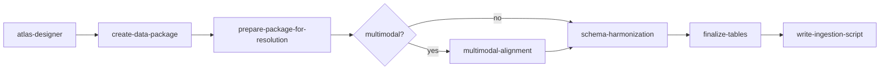

# Workflow

An auto-atlas run turns a public dataset (GEO, SRA, SCP, …) into a finalized [homeobox](https://epiblast.ai/homeobox/) atlas. The work is organized as a sequence of stages, each backed by an agent **skill** that documents the procedures and scripts for that stage. The stages are sequential: each skill assumes the previous ones have completed.



| Step | Skill | What it does |
|------|-------|--------------|
| 1 | `atlas-designer` | Design the target homeobox `schema.py` (obs tables, feature registries, dataset metadata, registry-key targets). |
| 2 | `create-data-package` | Download files, tag them with the [Collection API](collections.md), and write a coalesced data package (`collection.json` + per-dataset directories). |
| 3 | `prepare-package-for-resolution` | Stage raw OBS, VAR, LIBRARY, dataset scaffold, and publication tables into LanceDB — columns kept as-is from source files. |
| 4 | `multimodal-alignment` | *(Multimodal datasets only.)* Reconcile per-modality barcodes and write `multimodal_barcode` so cells can be joined across feature spaces. |
| 5 | `schema-harmonization` | Align columns to the schema, [resolve](resolvers.md) raw values to canonical identifiers (genes, ontologies, proteins, …), and record registry-key join columns. All mutations are [audited](curation.md). |
| 6 | `finalize-tables` | Assign automatic columns (`uid`, `dataset_uid`, `zarr_group`), join multimodal obs tables, populate registry keys, validate every table against the schema. |
| 7 | `write-ingestion-script` | Stream raw DATA matrices into the atlas as zarr groups via `auto_atlas.ingestion.ingest_collection`. |

Steps 1 and 2 are technically independent — neither requires the other's output — but in practice you define the atlas schema before downloading and organizing data, so that feature spaces, registry tables, and metadata fields are settled before staging begins.

## Install

Install the package and agent skills:

```bash
pip install -e .
curl -sSL https://raw.githubusercontent.com/epiblastai/auto-atlas/refs/heads/main/install.sh | bash
```

The install script copies skills from `skills/` into `~/.agents/skills/` and links them for Claude at `~/.claude/skills/`. Each skill documents the procedures and scripts for one workflow stage.

## Scripts by workflow stage

Paths are relative to the repository root. When a skill is installed, its scripts live under that skill's directory (e.g. `~/.agents/skills/create-data-package/scripts/`).

### 1. atlas-designer

No scripts — this skill produces a `schema.py` file. A reference example lives at `skills/atlas-designer/references/multimodal_perturbation_atlas_schema.py`.

### 2. create-data-package

Organize downloaded files into a collection data package using the [Collection API](collections.md) (`auto_atlas.collection`). Scripts assist with common public-database sources.

| Script | Usage | Purpose |
|--------|-------|---------|
| `write_publication_json.py` | `python …/write_publication_json.py <dir> --pmid 40259084` | Fetch a publication from PubMed/PMC and write `publication.json`. |
| `write_metadata_json.py` | `python …/write_metadata_json.py <dir> GSE123456` | Fetch GEO metadata and write `<accession>_metadata.json`. |
| `list_geo_files.py` | `python …/list_geo_files.py GSE123456` | List supplementary files for a GEO accession. |
| `download_geo_file.py` | `python …/download_geo_file.py GSE123456 file.h5ad [dest]` | Download a supplementary file from GEO via FTP. |

See `skills/create-data-package/references/geo_instructions.md` for GEO-specific guidance.

### 3. prepare-package-for-resolution

Stage raw tables into LanceDB under each dataset's `lance_db/` (and collection-level `lance_db/` for shared registries). Staged columns are not yet schema-aligned.

| Script | Purpose |
|--------|---------|
| `stage_lance_tables.py` | Stage OBS and VAR tables per dataset. |
| `stage_library_table.py` | Stage a collection-level LIBRARY file into a named schema table. |
| `stage_dataset_table.py` | Stage the per-dataset `DatasetSchema` scaffold (one row per feature space). |
| `stage_publication_tables.py` | Stage `publication.json` into collection-level publication registry tables. |

### 4. multimodal-alignment

Run only when a dataset has two or more feature-space obs tables (CITE-seq, Multiome, …).

| Script | Purpose |
|--------|---------|
| `reconcile_barcodes.py` | Pick a barcode normalization that maximizes cross-modality overlap and write `multimodal_barcode`. |

### 5. schema-harmonization

Harmonize every staged table to its target schema class. Mutations go through the audited `CurationApplicator` — never edit Lance directly. See [Curation](curation.md) and [Resolvers](resolvers.md).

| Script | Purpose |
|--------|---------|
| `apply_resolution_pass.py` | Run a single resolver (`resolve_genes`, `resolve_cell_types`, …) on one column, or fan out a multi-field resolver with `--fanout`. |

Most harmonization work is custom curation transactions planned per table; the script accelerates the common single-column resolution passes.

### 6. finalize-tables

Run after harmonization has finished on **every** table in the collection. The main entrypoint resolves registry-key dependencies in DAG order.

| Script | Purpose |
|--------|---------|
| `finalize_collection.py` | **Entrypoint** — join multimodal obs, assign uids, stamp `dataset_uid`, populate registry keys, drop leftovers, validate. |
| `join_feature_space_obs.py` | Outer-join per-feature-space obs tables on `multimodal_barcode`. |
| `stamp_uid_on_feature_space_obs.py` | Copy obs `uid` values onto per-feature-space tables for DATA row alignment at ingestion. |
| `assign_uids.py` | Assign `uid` or `zarr_group` per table. |
| `set_dataset_uid.py` | Broadcast the dataset's `uid` onto obs rows. |
| `populate_registry_keys.py` | Resolve `*_join` columns to target `uid`s and fill registry-key fields. |
| `drop_leftover_columns.py` | Drop non-schema source columns (audited). |
| `ensure_schema_columns.py` | Null-initialize any missing non-deferred schema columns. |
| `validate_tables.py` | Validate every table against its schema class. |

### 7. write-ingestion-script

Ingestion scripts are collection-specific — they declare one `Loader` per feature space and call `auto_atlas.ingestion.ingest_collection`. For example, `scripts/ingest_gse264667.py` ingests HepG2 and Jurkat Perturb-seq datasets from `.h5ad` files into a homeobox atlas.

## On-disk layout after finalization

```
collection_root/
  collection.json                # manifest: datasets, uids, DATA file tags
  lance_db/                      # collection-level registry tables
  <dataset>/
    lance_db/
      <ObsClass>                 # finalized obs (joined for multimodal)
      <ObsClass>_<feature_space> # per-fs uid artifact for DATA row alignment
      <DatasetClass>             # one row per feature space; zarr_group set
      <RegistryClass>            # feature registry / var table
    <DATA files>                 # raw matrices, unchanged
```

Ingestion reads this layout, streams DATA into zarr, and fills pointer fields and summary aggregates deferred until write time.
